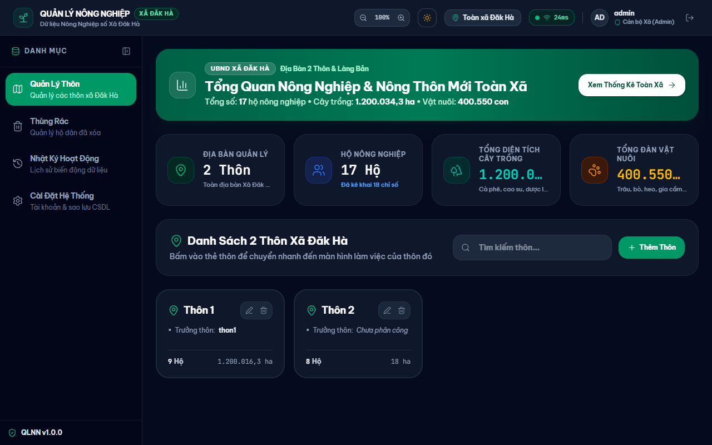
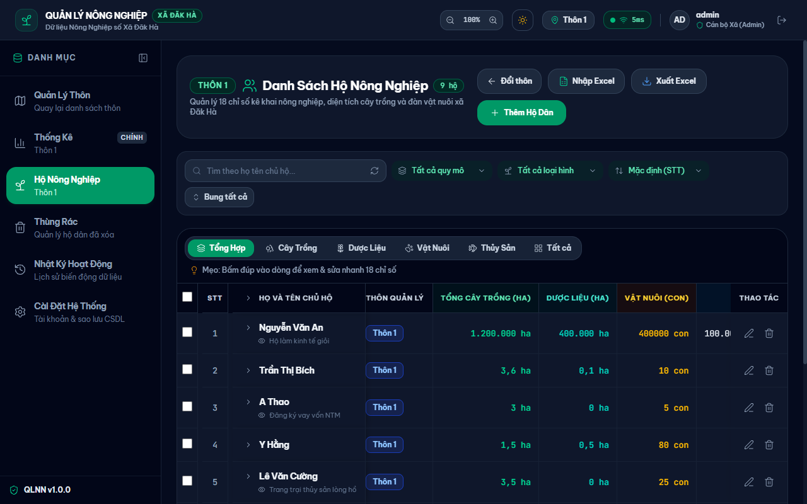
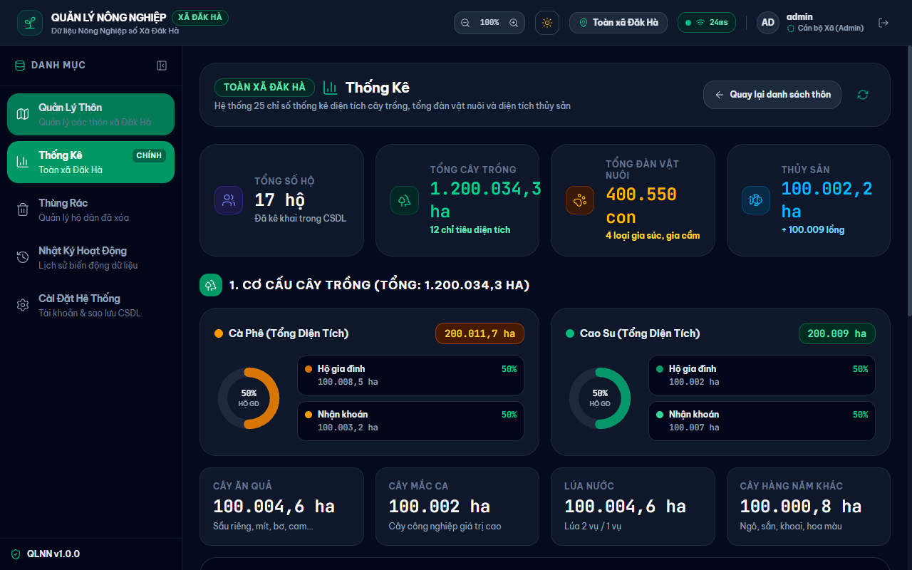
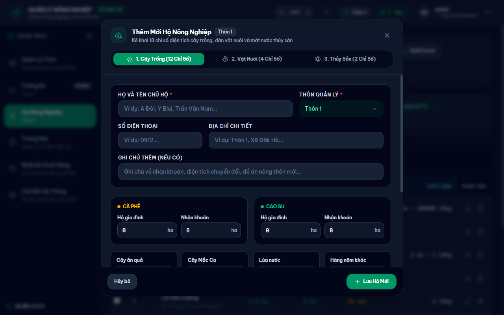
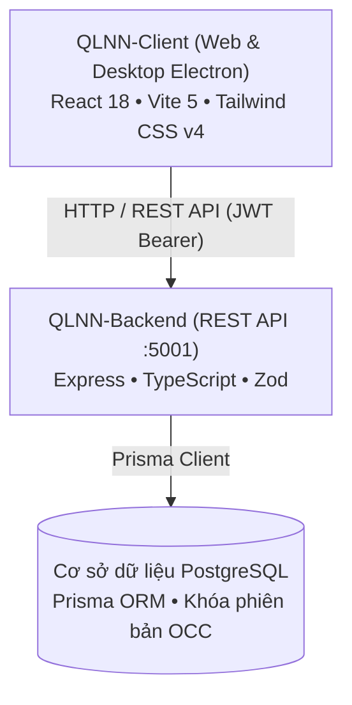

# Quản lý Nông nghiệp & Nông thôn mới Xã Đăk Hà (QLNN)

Hệ thống số hóa và theo dõi 18 chỉ số nông nghiệp, cơ cấu cây trồng, vật nuôi và thủy sản phục vụ công tác quản lý điều hành tại Xã Đăk Hà.


> [!IMPORTANT]
> **Bản quyền thuộc Ủy ban nhân dân Xã Đăk Hà, Huyện Đăk Hà, Tỉnh Kon Tum.**  
> Mọi quyền được bảo lưu. Dự án này không áp dụng giấy phép mã nguồn mở tự do (không sử dụng MIT License, Apache hoặc GPL). Chi tiết xem tại mục [Giấy phép và bản quyền](#giay-phep-va-ban-quyen).

---

## Mục lục

- [Tổng quan](#tong-quan)
- [Ảnh chụp màn hình](#anh-chup-man-hinh)
- [Tính năng chính](#tinh-nang-chinh)
- [Kiến trúc hệ thống](#kien-truc-he-thong)
- [Bắt đầu nhanh](#bat-dau-nhanh)
- [Cấu trúc thư mục](#cau-truc-thu-muc)
- [Bảo mật](#bao-mat)
- [Trạng thái và giới hạn đã biết](#trang-thai-va-gioi-han-da-biet)
- [Người duy trì và liên hệ](#nguoi-duy-tri-va-lien-he)
- [Giấy phép và bản quyền](#giay-phep-va-ban-quyen)

---

<a id="tong-quan"></a>
## Tổng quan

**QLNN** là phần mềm phục vụ cán bộ nông nghiệp xã và các trưởng thôn trong việc quản lý dữ liệu sản xuất nông nghiệp của từng hộ gia đình. Ứng dụng hỗ trợ theo dõi 18 chỉ tiêu nông nghiệp, nhập xuất bảng tính Excel đối soát số liệu và tổng hợp báo cáo nông thôn mới. Phần mềm chạy song song trên nền tảng Web và Desktop (Electron) cho máy trạm làm việc.

### Hệ sinh thái số hóa công vụ Xã Đăk Hà

| Ứng dụng | Tên đầy đủ | Vai trò chính | Kho lưu trữ |
| :--- | :--- | :--- | :--- |
| **QLCS** | Quản lý Chính sách | Chế độ người cao tuổi, hưu trí xã hội, chúc thọ | [Umnuar/QLCS](https://github.com/Umnuar/QLCS) |
| **QLHK** | Quản lý Hộ khẩu | Dữ liệu dân cư, nhân hộ khẩu, dân tộc | [Umnuar/QLHK](https://github.com/Umnuar/QLHK) |
| **QLNN** | Quản lý Nông nghiệp | Dữ liệu nông nghiệp, nông thôn mới, thống kê cây trồng và vật nuôi | [Umnuar/QLNN](https://github.com/Umnuar/QLNN) |

---

<a id="anh-chup-man-hinh"></a>
## Ảnh chụp màn hình

| Tổng quan các thôn và chỉ số nông nghiệp | Danh sách hộ nông nghiệp và bộ lọc |
| :---: | :---: |
|  |  |

| Biểu đồ thống kê nông nghiệp | Biểu mẫu kê khai 18 chỉ số |
| :---: | :---: |
|  |  |

---

<a id="tinh-nang-chinh"></a>
## Tính năng chính

- **Quản lý hộ nông nghiệp**: Theo dõi thông tin hộ gia đình, họ tên chủ hộ, địa chỉ và ghi chú theo từng thôn thuộc địa bàn xã.
- **Giám sát 18 chỉ số nông nghiệp**: Quản lý diện tích 12 loại cây trồng (cà phê, cao su, cây ăn quả, mắc ca, 4 loại dược liệu, lúa nước, cây hàng năm khác), 4 loại vật nuôi (trâu, bò, heo, gia cầm) và 2 loại thủy sản (ao cá, lồng bè).
- **Nhập xuất Excel 21 cột**: Hỗ trợ đọc tệp bảng tính 21 cột phẳng, kiểm tra dữ liệu, xem trước có cố định 2 cột đầu (số thứ tự và tên chủ hộ) và xuất báo cáo tổng hợp.
- **Khóa lạc quan (OCC)**: Sử dụng trường phiên bản để phát hiện xung đột khi nhiều người cùng cập nhật một bản ghi, cung cấp nút nạp lại dữ liệu mới.
- **Phân quyền theo địa bàn**: Giới hạn phạm vi thao tác của Trưởng Thôn theo đơn vị được phân công; Cán bộ Xã (Admin) có quyền quản trị toàn xã.
- **Thùng rác và khôi phục**: Hỗ trợ xóa mềm bản ghi, cho phép khôi phục đơn lẻ hoặc khôi phục hàng loạt kèm các bảng chỉ số liên kết.
- **Nhật ký biến động**: Ghi nhận lịch sử thao tác dữ liệu kèm giao diện đối chiếu sai khác trực quan.
- **Thống kê và phân tích**: Tổng hợp số liệu diện tích và đàn vật nuôi qua các câu truy vấn cơ sở dữ liệu gom nhóm trực tiếp.

---

<a id="kien-truc-he-thong"></a>
## Kiến trúc hệ thống



### Bảng công nghệ chính

| Thành phần | Công nghệ | Phiên bản |
| :--- | :--- | :--- |
| Giao diện người dùng | React, Tailwind CSS | React 18.2.0, Tailwind CSS 4.2.4 |
| Nền tảng Desktop | Electron, Electron Builder | Electron 42.1.0, Electron Builder 24.13.3 |
| Công cụ xây dựng Client | Vite, TypeScript | Vite 5.1.6, TypeScript 5.2.2 |
| Xử lý bảng tính Client | SheetJS (xlsx) | 0.18.5 |
| Máy chủ API | Express, TypeScript | Express 4.21.0, TypeScript 5.6.0 |
| Cơ sở dữ liệu và ORM | PostgreSQL, Prisma ORM | Prisma 6.0.0, pg 8.23.0 |
| Xác thực và bảo mật | JWT, Bcryptjs, Helmet | jsonwebtoken 9.0.2, bcryptjs 3.0.3, helmet 8.0.0 |
| Kiểm thử Backend | Jest, ts-jest, Supertest | Jest 30.5.0, Supertest 7.2.2 |

---

<a id="bat-dau-nhanh"></a>
## Bắt đầu nhanh

### Yêu cầu môi trường
- Node.js phiên bản 18 hoặc 20 trở lên
- npm phiên bản 9 hoặc 10 trở lên

### Cài đặt mã nguồn

```bash
# 1. Cài đặt Backend
cd QLNN-Backend
npm install
cp .env.example .env

# 2. Sinh Prisma Client và cập nhật cấu trúc cơ sở dữ liệu
npm run prisma:generate
npm run prisma:push

# 3. Cài đặt Client
cd ../QLNN-Client
npm install
cp .env.example .env
```

### Cấu hình biến môi trường

**Backend (`QLNN-Backend/.env`):**

| Tên biến | Ý nghĩa | Bắt buộc |
| :--- | :--- | :--- |
| `PORT` | Cổng máy chủ lắng nghe (mặc định 5001) | Không |
| `NODE_ENV` | Môi trường thực thi (`development` / `production` / `test`) | Không |
| `DATABASE_URL` | Chuỗi kết nối cơ sở dữ liệu PostgreSQL qua pooler | Có |
| `DIRECT_URL` | Chuỗi kết nối cơ sở dữ liệu trực tiếp chạy migration | Có |
| `JWT_SECRET` | Khóa bí mật ký Access Token | Có |
| `JWT_REFRESH_SECRET` | Khóa bí mật ký Refresh Token | Có |
| `CORS_ORIGIN` | Danh sách domain hoặc cổng được phép truy cập CORS | Không |

**Client (`QLNN-Client/.env`):**

| Tên biến | Ý nghĩa | Bắt buộc |
| :--- | :--- | :--- |
| `VITE_API_URL` | Đường dẫn API Backend (mặc định `http://localhost:5001/api`) | Có |

### Chạy ứng dụng

```bash
# Chạy Backend (cổng 5001)
cd QLNN-Backend
npm run dev

# Chạy Client (giao diện Web và Desktop Electron)
cd QLNN-Client
npm run dev
```

### Kiểm thử và đóng gói

```bash
# Chạy kiểm thử Backend (Jest)
cd QLNN-Backend
npm test

# Chạy kiểm thử Client (Vitest)
cd QLNN-Client
npm test

# Đóng gói bản phát hành Client
cd QLNN-Client
npm run build:vite  # Bản Web
npm run build:win   # Bộ cài đặt Desktop Windows (.exe)
```

---

<a id="cau-truc-thu-muc"></a>
## Cấu trúc thư mục

```
QLNN/
├── QLNN-Backend/            # Dịch vụ máy chủ REST API
│   ├── prisma/              # Lược đồ cơ sở dữ liệu và cấu hình Prisma
│   ├── src/config/          # Cấu hình Prisma và kết nối dịch vụ
│   ├── src/controllers/     # Xử lý nghiệp vụ API hộ dân, thống kê, xác thực
│   ├── src/middlewares/     # Middleware xác thực JWT và kiểm soát quyền theo thôn
│   ├── src/routes/          # Định tuyến các cổng API
│   └── src/tests/           # Bộ kiểm thử tích hợp Jest
├── QLNN-Client/             # Ứng dụng giao diện Web và Desktop
│   ├── electron/            # Tiến trình chính Electron và cầu nối IPC
│   ├── src/api/             # Các hàm gọi API qua Axios
│   ├── src/components/      # Thành phần giao diện, biểu mẫu và bảng số liệu
│   ├── src/pages/           # Các màn hình chính của ứng dụng
│   └── src/tests/           # Bộ kiểm thử thành phần giao diện Vitest
├── docs/                    # Tài liệu kiến trúc và kết quả kiểm thử
├── ui-sync/                 # Tài liệu quy chuẩn đồng bộ giao diện
├── SECURITY.md              # Chính sách an toàn thông tin và tiếp nhận sự cố
└── README.md                # Tài liệu hướng dẫn sử dụng và triển khai
```

---

<a id="bao-mat"></a>
## Bảo mật

Hệ thống áp dụng xác thực JWT độc lập, phân quyền truy cập nghiêm ngặt theo địa bàn thôn ở tầng máy chủ và ghi nhận nhật ký thao tác để phục vụ tra soát. Phần mềm được thiết kế hướng tới bảo vệ dữ liệu sản xuất của các hộ gia đình.

Chi tiết về quy trình tiếp nhận và xử lý báo cáo lỗ hổng an ninh thông tin xem tại [SECURITY.md](SECURITY.md).

---

<a id="trang-thai-va-gioi-han-da-biet"></a>
## Trạng thái và giới hạn đã biết

- **Trạng thái**: Đang vận hành thử nghiệm trên môi trường máy trạm phục vụ công tác số hóa tại địa phương.
- **Giới hạn đã biết**: Danh mục thôn và tài khoản cán bộ cần được thiết lập trước trong cơ sở dữ liệu; việc thực thi kiểm thử phía Client cần môi trường Node tương thích với cấu hình phân giải tệp kiểm thử.
- **Hướng phát triển**: Tiếp tục hoàn thiện tính năng sao lưu dữ liệu tự động định kỳ và bổ sung biểu đồ phân tích cơ cấu kinh tế nông thôn.

---

<a id="nguoi-duy-tri-va-lien-he"></a>
## Người duy trì và liên hệ

- **Đơn vị duy trì**: Ban CĐS UBND Xã Đăk Hà
- **Địa bàn**: Xã Đăk Hà, Huyện Đăk Hà, Tỉnh Kon Tum
- **Kênh tiếp nhận kỹ thuật**: `admin@dulieudakha.vn`

---

<a id="giay-phep-va-ban-quyen"></a>
## Giấy phép và bản quyền

Toàn bộ mã nguồn, cấu trúc dữ liệu và tài liệu kỹ thuật của dự án này thuộc quyền sở hữu trí tuệ của **Ủy ban nhân dân Xã Đăk Hà, Huyện Đăk Hà, Tỉnh Kon Tum**. Mọi quyền được bảo lưu (All Rights Reserved). Dự án không áp dụng giấy phép mã nguồn mở (không áp dụng MIT License, Apache hoặc GPL). Nghiêm cấm sao chép, chỉnh sửa, phân phối lại hoặc sử dụng vào mục đích thương mại khi chưa có văn bản chấp thuận chính thức từ cơ quan chủ quản.
