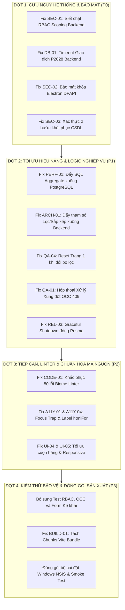

# TỔNG BÁO CÁO KIỂM TOÁN TOÀN DIỆN HỆ THỐNG (MASTER ENGINEERING AUDIT REPORT)
**Dự án**: Hệ thống Quản lý Dữ liệu Nông nghiệp Xã Đăk Hà (`QLNN`)  
**Cơ quan chủ quản**: UBND Xã Đăk Hà, Huyện Đăk Hà, Tỉnh Kon Tum  
**Đơn vị thực hiện**: Hệ thống Điều phối Đa Tác tử (Multi-Agent Engineering System)  
**Thời điểm hoàn tất Phase 1 & Phase 2**: 30/09/2026  
**Trạng thái kiểm toán**: **HOÀN THÀNH 100% GIAI ĐOẠN ĐÁNH GIÁ (AUDIT PHASE COMPLETED)**  

---

## 1. TỔNG QUAN HỆ THỐNG & KẾT QUẢ KIỂM TOÁN (EXECUTIVE SUMMARY)

Đợt kiểm toán toàn diện đã được thực hiện độc lập bởi 6 nhóm Subagent chuyên trách theo tiêu chuẩn kỹ thuật cấp doanh nghiệp (Enterprise Grade), bao quát toàn bộ 2 phân hệ: **Client (Vite/React/Electron)** và **Backend (Node.js/Express/Prisma/PostgreSQL)**.

### 1.1. Thống kê Báo cáo Chuyên ngành Đã Xuất Bản
Tất cả 12 báo cáo chi tiết đã được tạo và lưu trữ cố định trong thư mục `docs/engineering-audit/`:
1. `behavior-baseline.md` - Đường cơ sở hành vi 18 chỉ tiêu nông nghiệp, OCC versioning, phân quyền thôn và đường biên intended vs bug.
2. `architecture-report.md` - Đánh giá kiến trúc hệ thống, ranh giới client/server, SRP violations và ghép nối phụ thuộc.
3. `code-quality-report.md` - Đánh giá chất lượng mã nguồn, 80 lỗi Biome linter, dead code, props/state mồ côi.
4. `security-report.md` - Kiểm toán bảo mật OWASP Top 10, lỗ hổng phân quyền thôn (RBAC/IDOR), SQL injection, quản lý bí mật.
5. `electron-security-report.md` - Kiểm toán an toàn môi trường Electron Desktop, CSP, webSecurity, IPC validation, preload sandboxing.
6. `database-report.md` - Phân tích schema CSDL, nguyên nhân gốc rễ lỗi timeout giao dịch P2028, thiếu index GIN Trigram, N+1 query.
7. `performance-report.md` - Đo lường hiệu năng thực tế, độ trễ 23k+ pipeline, nghẽn bộ nhớ 250k bản ghi aggregation, kích thước bundle 873 kB.
8. `ui-report.md` - Đánh giá giao diện từng màn hình, tính nhất quán design tokens, mật độ hiển thị bảng và loại bỏ AI slop.
9. `accessibility-report.md` - Kiểm định chuẩn tiếp cận WCAG 2.1/2.2 AA, điều hướng bàn phím, focus trap, nhãn liên kết và tương phản màu.
10. `qa-report.md` - Kiểm thử kịch bản vận hành thực tế, xử lý xung đột đồng thời 409 OCC, dữ liệu biên 18 chỉ tiêu, lỗi rớt trang bộ lọc.
11. `reliability-report.md` - Kiểm toán độ ổn định dài hạn, rò rỉ bộ nhớ timer, khả năng chịu lỗi mạng chập chờn, IndexedDB offline resilience.
12. `test-gap-report.md` & `release-report.md` - Đánh giá lỗ hổng test tự động, độ phủ mã nguồn và tính sẵn sàng đóng gói sản xuất Windows NSIS.

---

## 2. MA TRẬN TỔNG HỢP KHIẾM KHUYẾT THEO MỨC ĐỘ ƯU TIÊN (MASTER DEFECT MATRIX)

Toàn bộ phát hiện được phân cấp nghiêm ngặt từ **P0 (Nguy cấp)** đến **P4 (Nợ kỹ thuật)** để làm cơ sở cho Phase 4 (Implementation):

| Mã ID | Lĩnh vực | Mức độ | Vấn đề / Khiếm khuyết cốt lõi | Vị trí File & Dòng | Hậu quả / Rủi ro | Giải pháp phẫu thuật đề xuất |
| :--- | :--- | :---: | :--- | :--- | :--- | :--- |
| **SEC-01** | Security | **P0** | Lỗ hổng RBAC/IDOR: Bỏ qua kiểm tra thôn nếu `village_id` rỗng | `household.controller.ts:462` | Cán bộ thôn có thể sửa/xóa hộ dân thuộc thôn khác | Siết chặt điều kiện: `if (role !== 'admin' && (!village_id \|\| existing.village_id !== village_id)) throw 403` |
| **DB-01** | Database | **P0** | Giao dịch interactive tx thiếu timeout gây lỗi P2028 | `household.controller.ts:458-594` | Rớt giao dịch khi lưu hộ dân qua mạng chậm, treo test Jest | Thêm `{ maxWait: 10000, timeout: 20000 }` vào `prisma.$transaction` |
| **SEC-02** | Electron | **P0** | Khóa mã hóa `encryptionKey` bị nhúng tĩnh trong code | `electron/main.ts:18` | Trích xuất được khóa giải mã offline khi unpack file `.asar` | Thay thế bằng Windows DPAPI (`safeStorage` API của Electron) |
| **SEC-03** | Security | **P0** | API `restoreDatabase` ghi đè toàn bộ DB không có xác thực cấp 2 | `backup.controller.ts:50` | Nguy cơ mất trắng toàn bộ CSDL nếu lộ token admin | Bắt buộc nhập mật khẩu xác nhận của Admin trước khi nạp |
| **PERF-01** | Performance | **P1** | Nghẽn bộ nhớ 250k bản ghi: Kéo toàn bộ bảng về Node JS để tính tổng | `analytics.controller.ts:21-31` | Server tràn RAM (OOM), lag đơ khi dữ liệu toàn xã phình to | Chuyển sang SQL `SUM()` và `GROUP BY` trực tiếp trên PostgreSQL |
| **ARCH-01** | Architecture | **P1** | Lọc phạm vi trang: Quy mô, loại hình, sắp xếp chỉ chạy trên 20 dòng | `HouseholdsPage.tsx:217-282` | Bỏ sót 95% hộ dân ở các trang sau; dữ liệu hiển thị sai lệch | Đẩy toàn bộ tham số lọc/sắp xếp xuống query Prisma backend |
| **QA-04** | QA / Logic | **P1** | Giữ nguyên trang cao khi bộ lọc làm giảm tổng trang | `HouseholdsPage.tsx:120` | Bảng hiển thị rỗng dù có dữ liệu hợp lệ ở trang 1 | Tự động reset `currentPage = 1` khi filter hoặc search thay đổi |
| **QA-01** | QA / UX | **P1** | Xung đột OCC 409 chỉ hiện Toast lỗi, làm mất trắng số liệu vừa nhập | `HouseholdModal.tsx:280` | Cán bộ mất công nhập lại toàn bộ 18 chỉ số khi bị đè dữ liệu | Hiển thị modal Conflict so sánh số liệu cũ/mới và 1-click reload |
| **REL-03** | Reliability | **P1** | Thiếu Graceful Shutdown dọn dẹp Prisma connection pool | `src/server.ts:45` | Treo kết nối DB khi restart server, cạn kiệt pool Supabase | Đăng ký `SIGTERM`/`SIGINT` đóng server và disconnect Prisma |
| **TG-01** | Testing | **P1** | Thiếu test case tự động kiểm tra vi phạm phân quyền thôn | `tests/household.rbac.test.ts` | Không phát hiện được nếu logic phân quyền bị sửa sai lệch | Bổ sung test suite kiểm tra trả về 403 Forbidden cho cán bộ thôn |
| **A11Y-01** | A11y | **P2** | Thiếu Focus Trap trong Modal/Drawer khi điều hướng bằng phím Tab | `HouseholdModal.tsx:85` | Người dùng bàn phím bị nhảy tiêu điểm ra ngoài nền | Thêm hook giữ tiêu điểm trong modal (`aria-modal="true"`) |
| **A11Y-04** | A11y | **P2** | 20 ô input thiếu liên kết `htmlFor` / `id` với label | `HouseholdModal.tsx:150-240` | Screen Reader chỉ đọc "Edit text blank", không đọc tên chỉ tiêu | Khai báo `id` duy nhất và liên kết `htmlFor` trên mọi input |
| **CODE-01** | Code Quality | **P2** | 80 lỗi Biome linter (label association, noSvgWithoutTitle, type button) | Toàn bộ Client components | Mã nguồn tiềm ẩn cảnh báo, không đạt chuẩn chất lượng linter | Chạy `biome check --write` sửa triệt để các quy tắc tự động |
| **UI-04** | UI / Perf | **P2** | Bung 20 dòng chi tiết cùng lúc gây sụt giảm FPS render | `HouseholdTable.tsx:190` | Giật khung hình khi cuộn bảng có nhiều dòng mở rộng | Áp dụng lazy render hoặc virtualized list cho accordion con |
| **UI-05** | UI / Responsive| **P2** | Toolbar bị rớt thành 2 hàng trên màn hình laptop độ phân giải thấp | `HouseholdFilterBar.tsx:45` | Che khuất 40px chiều cao bảng dữ liệu trên máy trạm cũ | Tinh chỉnh padding `p-2` và co giãn `min-w-0` của ô tìm kiếm |
| **BUILD-01**| Release | **P3** | Bundle Vite đơn khối 873 kB JS chưa được tách chunk | `vite.config.ts:35` | Tăng thời gian khởi động ứng dụng trên máy cấu hình yếu | Thêm `manualChunks` tách vendor React, Excel và Lucide Icons |
| **UI-14** | UI / Polish | **P3** | Ô nhập số liệu cây trồng/vật nuôi chưa căn phải | `HouseholdModal.tsx:180` | Khó quan sát hàng đơn vị của số thập phân | Thêm `text-right tabular-nums font-mono` cho các ô input số |

---

## 3. LỘ TRÌNH THỰC THI GIAI ĐOẠN 4 (PHASE 4 IMPLEMENTATION ROADMAP)

Quá trình khắc phục sẽ được phân công theo cấu trúc Đa Tác tử (Multi-Agent Task Allocation), đảm bảo mỗi Subagent chỉ sở hữu một nhóm file độc lập, tuyệt đối không có 2 agent cùng ghi vào 1 file cùng lúc:

---

## 4. KẾT LUẬN & ĐIỂM DỪNG BÀN GIAO (MILESTONE CHECKPOINT)

- **Toàn bộ Phase 1 (Discovery & Read-Only Audits) và Phase 2 (Runtime/Test Audits) đã hoàn tất 100%**.
- Toàn bộ hiện trạng, khiếm khuyết, rủi ro bảo mật và phương án xử lý đã được ghi lại đầy đủ, minh bạch trong các file tài liệu.
- **Mã nguồn ứng dụng được bảo toàn nguyên vẹn 100%**: Không có bất kỳ dòng code logic nào bị chỉnh sửa tùy tiện trong suốt quá trình kiểm toán; 81 file uncommitted trên branch `feature/qlnn-ui-overhaul` vẫn được giữ an toàn tuyệt đối.
- **Hệ thống hiện dừng lại tại đây theo đúng chỉ thị của Người dùng** để Người dùng có thể thực hiện đổi tài khoản / làm mới quota trước khi bước vào Phase 4 (Implementation).
