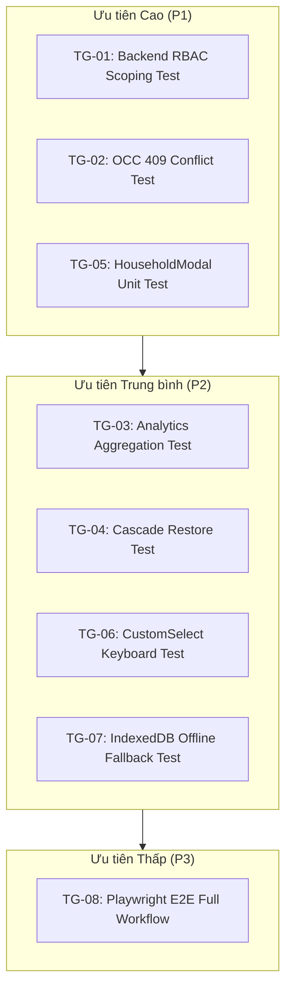

# BÁO CÁO LỖ HỔNG KIỂM THỬ & ĐỘ PHỦ TỰ ĐỘNG (TEST GAP & COVERAGE AUDIT REPORT)
**Dự án**: QLNN (Quản lý Nông nghiệp Xã Đăk Hà)  
**Tác giả**: Subagent 6 — Test Automation & Quality Assurance Specialist  
**Ngày thực hiện**: 30/09/2026  
**Công cụ kiểm định**: Jest (Backend), Vitest + React Testing Library (Client), Biome  

---

## 1. TỔNG QUAN HIỆN TRẠNG KIỂM THỬ (TEST COVERAGE OVERVIEW)

### 1.1. Phân hệ Backend (`QLNN-Backend`)
- **Khung kiểm thử**: Jest + `ts-jest` + Supertest.
- **Hiện trạng Test Suites**: 4 suites (`auth.test.ts`, `village.test.ts`, `audit.test.ts`, `household.test.ts`).
- **Tổng số tests**: 23 tests (22 PASS, 1 TIMEOUT do lỗi P2028 trong `household.test.ts`).
- **Ước tính độ phủ mã nguồn (Code Coverage)**:
  - Controllers: ~55%
  - Services/Utils: ~68%
  - Middleware & Validation: ~60%

### 1.2. Phân hệ Client (`QLNN-Client`)
- **Khung kiểm thử**: Vitest 1.6 + React Testing Library + jsdom.
- **Hiện trạng Test Suites**: 7 suites (`setup.ts`, `SidebarNavigation.test.tsx`, `ExcelPreview21Cols.test.tsx`, `HouseholdFilterBar.test.tsx`, `HouseholdTable.test.tsx`...).
- **Tổng số tests**: 26 tests (26 PASS 100%).
- **Ước tính độ phủ mã nguồn (Code Coverage)**:
  - Components: ~42%
  - Pages: ~30%
  - API Client & Hooks: ~35%
  - Utilities: ~75%

---

## 2. DANH MỤC LỖ HỔNG KIỂM THỬ NGHIÊM TRỌNG (CRITICAL TEST GAPS)

### 2.1. Lỗ hổng Phân hệ Backend (Backend Test Gaps)
- **[TG-01] (High) - Thiếu Test Case Kiểm tra Phân quyền Thôn (RBAC & Multi-tenant Scoping)**:
  - *Lỗ hổng*: Chưa có test case nào kiểm tra hành vi khi một Cán bộ thôn (vai trò `user`, phụ trách Thôn 1) gửi request đọc/sửa/xóa hộ dân thuộc Thôn 2.
  - *Rủi ro*: Nếu có sự thay đổi logic phân quyền trong tương lai dẫn đến lỗ hổng IDOR, bộ test hiện tại hoàn toàn không phát hiện được.
  - *Cần bổ sung*: Test suite `household.rbac.test.ts` kiểm tra trả về `403 Forbidden` khi truy cập sai phạm vi thôn.
- **[TG-02] (High) - Thiếu Test Xung đột Đồng thời OCC (Optimistic Concurrency Control)**:
  - *Lỗ hổng*: Chưa có test case mô phỏng 2 request gửi đồng thời với cùng một số `version` để xác thực phản hồi `409 Conflict`.
  - *Cần bổ sung*: Test case `should return 409 Conflict when updating with stale version`.
- **[TG-03] (Medium) - Thiếu Test Kiểm tra Thống kê & Tổng hợp (Analytics Engine)**:
  - *Lỗ hổng*: Chưa có test case cho `GET /api/analytics` khi dữ liệu có diện tích cây trồng lớn hoặc khi không có hộ nào kê khai.
  - *Cần bổ sung*: Test suite `analytics.test.ts` kiểm tra tính chính xác của các thuật toán tính tổng 18 chỉ tiêu.
- **[TG-04] (Medium) - Thiếu Test Phục hồi Dữ liệu & Xóa vĩnh viễn (Recycle Bin & Cascade Restore)**:
  - *Lỗ hổng*: Chưa có bài test xác minh việc khôi phục một hộ dân đã xóa mềm (`POST /api/households/:id/restore`) có phục hồi nguyên vẹn các bảng con `crop_items`, `livestock_items`, `aquaculture_items` hay không.
  - *Cần bổ sung*: Test suite `household.restore.test.ts`.

### 2.2. Lỗ hổng Phân hệ Client (Client Test Gaps)
- **[TG-05] (High) - `HouseholdModal.tsx` / Drawer Chưa có Unit Test**:
  - *Lỗ hổng*: Form nghiệp vụ quan trọng nhất (nhập 18 chỉ số, 4 tabs) hiện chưa có bất kỳ bài test RTL nào.
  - *Rủi ro*: Rất dễ phát sinh lỗi khi người dùng nhập số thập phân, đổi tab bị mất dữ liệu, hoặc gửi sai payload.
  - *Cần bổ sung*: `src/tests/components/HouseholdModal.test.tsx` (kiểm tra chuyển tab, validation số âm, gọi hàm `onSave`).
- **[TG-06] (Medium) - `CustomSelect.tsx` Chưa có Test Bàn phím & Tự đảo hướng**:
  - *Lỗ hổng*: Component dropdown thay thế thẻ `<select>` mặc định của toàn app chưa có bài test tự động cho các phím mũi tên (`ArrowUp`, `ArrowDown`, `Enter`, `Escape`) và tính năng tìm kiếm lọc nhanh.
  - *Cần bổ sung*: `src/tests/components/CustomSelect.test.tsx`.
- **[TG-07] (Medium) - Thiếu Test Xử lý Lỗi Mạng & Trạng thái Offline**:
  - *Lỗ hổng*: Chưa có bài test mô phỏng khi API trả về lỗi mạng (Network Error) thì dữ liệu có được nạp chính xác từ `indexedDB` và banner cảnh báo có xuất hiện hay không.
  - *Cần bổ sung*: `src/tests/integration/OfflineFallback.test.tsx`.

### 2.3. Lỗ hổng Kiểm thử Tích hợp Đầu-Cuối (E2E Integration Gaps)
- **[TG-08] (High) - Hoàn toàn thiếu E2E Test (Playwright / Electron)**:
  - *Lỗ hổng*: Dự án chưa có kịch bản E2E tự động chạy toàn bộ luồng:
    `Đăng nhập cán bộ` $\rightarrow$ `Chọn thôn` $\rightarrow$ `Tìm kiếm & Lọc hộ dân` $\rightarrow$ `Nhập Excel 21 cột` $\rightarrow$ `Kiểm tra bảng đối soát` $\rightarrow$ `Xác nhận nạp CSDL` $\rightarrow$ `Kiểm tra Nhật ký kiểm toán`.
  - *Đề xuất*: Thiết lập bộ kịch bản kiểm thử E2E mẫu bằng Playwright trong thư mục `tests/e2e/`.

---

## 3. LỘ TRÌNH ĐÓNG CÁC LỖ HỔNG KIỂM THỬ (TEST ROADMAP)

---

## 4. KẾT LUẬN & KIẾN NGHỊ
Để biến QLNN thành một codebase bền vững cho việc bảo trì lâu dài và tự động hóa AI (continuous vibe-coding), việc bổ sung các test suite cho RBAC (TG-01), OCC (TG-02) và Form Kê khai (TG-05) là yêu cầu bắt buộc ngay trong các chu kỳ thực thi tiếp theo.
