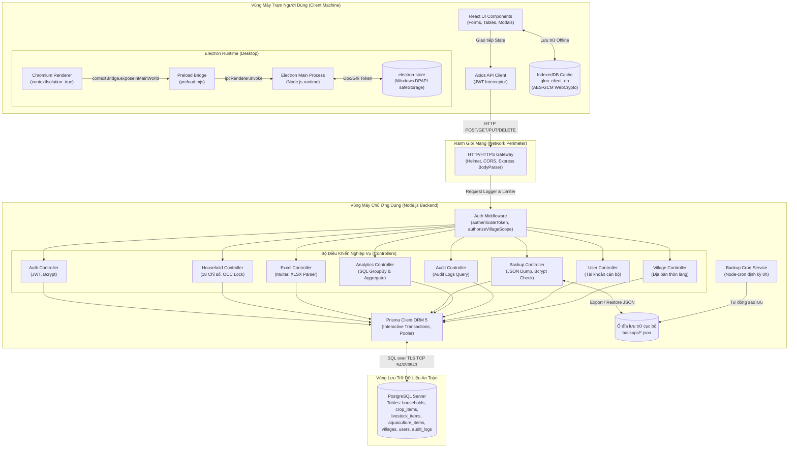

# TÀI LIỆU MÔ HÌNH HÓA MỐI ĐE DỌA (THREAT MODELING - STRIDE)
## Dự án: Hệ Thống Quản Lý Dữ Liệu Nông Nghiệp Xã Đăk Hà (QLNN)
**Cơ quan quản trị**: UBND Xã Đăk Hà, Huyện Đăk Hà, Tỉnh Kon Tum  
**Phiên bản tài liệu**: 1.0 (Kiểm kê và Đánh giá an ninh)  
**Tiêu chuẩn áp dụng**: 
- OWASP Top 10:2021
- OWASP API Security Top 10:2023
- OWASP Application Security Verification Standard (ASVS v4.0.3)
- CWE Top 25 (2023/2024)
- Electron Security Checklist (v42.x)
- Nghị định 13/2023/NĐ-CP về Bảo vệ dữ liệu cá nhân (*cần xác minh với chuyên gia pháp lý*)

---

## 1. TỔNG QUAN HỆ THỐNG & BỐI CẢNH VẬN HÀNH

Hệ thống QLNN là nền tảng quản trị dữ liệu nông nghiệp và nông thôn mới cấp xã, phục vụ 2 nhóm người dùng chính:
1. **Cán bộ UBND Xã (`admin`)**: Có toàn quyền quản trị 7 thôn làng thuộc xã Đăk Hà, cấu hình tài khoản cán bộ, sao lưu phục hồi cơ sở dữ liệu, quản lý thùng rác và xuất báo cáo cấp huyện/tỉnh.
2. **Trưởng thôn (`user`)**: Phụ trách 1 trong 7 thôn (Thôn 1, 2, 3, 4, 5, Kon Đao Yôp, Kon Hnông Bách), quản lý danh sách hộ nông nghiệp, 18 chỉ tiêu sản xuất nông lâm thủy sản, nhập xuất dữ liệu Excel trên địa bàn thôn mình được phân công.

Hệ thống vận hành dưới dạng ứng dụng kép:
- **Client**: Web SPA (React 18 + Vite 5 + Tailwind CSS v4) hoặc Desktop App (Electron 42.1.0) chạy trên máy trạm Windows tại UBND Xã.
- **Backend API**: Node.js 20 Express RESTful JSON API chạy trên cổng 5001 (hoặc reverse proxy HTTPS production).
- **Cơ sở dữ liệu**: PostgreSQL (Supabase Cloud hoặc máy chủ cơ sở dữ liệu nội bộ) kết nối qua Prisma ORM 5.

---

## 2. SƠ ĐỒ LUỒNG DỮ LIỆU (DATA FLOW DIAGRAMS - DFD)

### 2.1. DFD Cấp độ 0 (Context Diagram)

```mermaid
flowchart TD
    subgraph External["Các Tác Nhân Bên Ngoài (External Entities)"]
        UserAdmin["Cán bộ Xã (Admin)<br>[Toàn quyền 7 thôn]"]
        UserVillage["Trưởng Thôn (User)<br>[Giới hạn 1 thôn]"]
        Attacker["Kẻ tấn công tiềm năng<br>[Mạng nội bộ / Internet]"]
    end

    subgraph SystemBoundary["Hệ Thống Quản Lý Dữ Liệu Nông Nghiệp (QLNN)"]
        QLNNClient["QLNN Client<br>(React SPA / Electron App)"]
        QLNNAPI["QLNN Backend API<br>(Express / Node.js)"]
    end

    subgraph DataStorage["Vùng Lưu Trữ Dữ Liệu"]
        PostgresDB[("PostgreSQL Database<br>(Prisma ORM)")]
        LocalDisk[("Ổ đĩa cục bộ máy chủ<br>(backups/*.json)")]
    end

    UserAdmin -->|HTTPS / IPC| QLNNClient
    UserVillage -->|HTTPS / IPC| QLNNClient
    Attacker -.->|Dò quét / Thao túng gói tin| QLNNAPI

    QLNNClient -->|REST API (Bearer JWT)| QLNNAPI
    QLNNAPI -->|TCP TLS Connection Pool| PostgresDB
    QLNNAPI -->|Đọc / Ghi file JSON| LocalDisk
```

---

### 2.2. DFD Cấp độ 1 (Decomposed Component Flow)



---

## 3. CÁC RANH GIỚI TIN CẬY (TRUST BOUNDARIES)

Hệ thống được phân định thành 5 ranh giới tin cậy trọng yếu:

| Ranh giới | Tên Ranh giới | Bên Ngoài (Ít tin cậy hơn) | Bên Trong (Được bảo vệ) | Cơ chế kiểm soát bảo mật tại ranh giới |
| :---: | :--- | :--- | :--- | :--- |
| **TB-1** | **Client $\leftrightarrow$ Express API** | Trình duyệt Web / Máy trạm Electron / Mạng LAN / Internet | Node.js Express Backend API | - CORS Whitelist<br>- Helmet Security Headers<br>- JWT Bearer Authentication (`authenticateToken`)<br>- Phân quyền theo thôn (`authorizeVillageScope`)<br>- Express Body Limits (50MB) |
| **TB-2** | **Electron Renderer $\leftrightarrow$ Main Process** | Chromium Web Renderer (DOM/JS không có quyền Node.js) | Node.js Main Process (Quyền hạn OS cấp máy trạm) | - `contextIsolation: true`<br>- `nodeIntegration: false`<br>- `preload.mjs` với `contextBridge`<br>- Chặn URL ngoài (`setWindowOpenHandler: deny`, `will-navigate`)<br>- Kênh IPC giới hạn (`secure-store:*`, `dialog:open-file`, `app:set-zoom`) |
| **TB-3** | **Express Backend $\leftrightarrow$ PostgreSQL** | Node.js Server Process | PostgreSQL Database Engine | - Chuỗi kết nối TLS (`DATABASE_URL`, `DIRECT_URL`)<br>- Prisma ORM Parameterized Queries (chống SQLi)<br>- Quyền truy cập Database User cấp dịch vụ |
| **TB-4** | **Node.js Server $\leftrightarrow$ Local Filesystem** | Input từ người dùng API (File upload, JSON restore) | Hệ thống tệp OS máy chủ (`backups/`) | - Multer `memoryStorage` (không lưu file rác vào ổ đĩa)<br>- Bcrypt check mật khẩu Admin trước khi Restore<br>- Cơ chế tự động dọn dẹp file sao lưu quá 3 ngày (`THREE_DAYS`) |
| **TB-5** | **Client Application $\leftrightarrow$ Local Storage** | Người dùng sử dụng chung máy trạm Windows | Dữ liệu nhạy cảm lưu tạm (Token, Cache) | - Windows DPAPI via `safeStorage` cho token Electron<br>- Web Crypto API (AES-GCM 256-bit) cho IndexedDB cache<br>- Cơ chế tự động đăng xuất sau 30 phút không hoạt động |

---

## 4. DANH MỤC ĐIỂM VÀO HỆ THỐNG (ENTRY POINTS INVENTORY)

### 4.1. Danh mục HTTP API Endpoints

Toàn bộ các điểm vào API trên máy chủ `QLNN-Backend` (Cổng mặc định `5001`):

| Nhóm chức năng | Phương thức | Đường dẫn API | Xác thực | Phân quyền (RBAC / Scoping) | Tham số đầu vào (Inputs) | Dữ liệu nhạy cảm xử lý |
| :--- | :---: | :--- | :---: | :---: | :--- | :--- |
| **Hạ tầng & Giám sát** | `GET` | `/` | Không | Công khai | Không | Phiên bản, trạng thái dịch vụ |
| | `GET` | `/api/health` | Không | Công khai | Không | Uptime, trạng thái kết nối DB |
| | `GET` | `/api/ping` | Không | Công khai | Không | Đo độ trễ mạng (204 No Content) |
| | `GET` | `/api/auth-test` | Có | `authorizeVillageScope` | Header `Authorization: Bearer <token>` | Kiểm thử liên thông SSO |
| **Xác thực (Auth)** | `POST` | `/api/auth/login` | Không | Công khai | Body: `{ username, password }` | Mật khẩu cán bộ, sinh JWT Token |
| | `POST` | `/api/auth/refresh` | Không | Công khai | Body: `{ refreshToken }` | Refresh token, cấp phát Access token mới |
| | `GET` | `/api/auth/me` | Có | Mọi tài khoản | Header Bearer Token | Hồ sơ cán bộ hiện tại |
| **Hộ Nông Nghiệp** | `GET` | `/api/households` | Có | Scope Thôn | Query: `villageId, search, scaleFilter, typeFilter, sortBy, page, limit` | Danh sách hộ nông nghiệp, 18 chỉ tiêu |
| | `GET` | `/api/households/:id` | Có | Scope Thôn | Params: `:id` (UUID) | Chi tiết hộ nông nghiệp |
| | `POST` | `/api/households` | Có | Scope Thôn | Body: `full_name, phone, address, notes, village_id`, 18 chỉ số | Thông tin hộ mới, CCCD/SĐT nếu có |
| | `PUT` | `/api/households/:id` | Có | Scope Thôn | Params: `:id`, Body: thông tin sửa + `version` (OCC Lock) | Dữ liệu biến động nông hộ |
| | `DELETE` | `/api/households/:id` | Có | Scope Thôn | Params: `:id`, Body: `{ reason }` | Xóa mềm hộ vào thùng rác |
| | `POST` | `/api/households/bulk-delete` | Có | Scope Thôn | Body: `{ ids: string[], reason }` | Xóa mềm hàng loạt hộ |
| | `GET` | `/api/households/deleted` | Có | Scope Thôn | Query: `villageId` | Danh sách hộ trong thùng rác |
| | `PUT` | `/api/households/restore` | Có | Scope Thôn | Body: `{ ids: string[] }` | Phục hồi hộ nông nghiệp |
| | `DELETE` | `/api/households/hard-delete` | Có | **Admin Only** | Body: `{ ids: string[] }` | Xóa vĩnh viễn danh sách hộ |
| | `DELETE` | `/api/households/:id/permanent`| Có | **Admin Only** | Params: `:id` | Xóa vĩnh viễn 1 hộ đơn lẻ |
| **Nhập / Xuất Excel** | `POST` | `/api/excel/preview` | Có | Scope Thôn | Multipart: `file` (.xlsx), Query/Body: `villageId` | Tệp Excel biểu mẫu 21 cột của xã |
| | `POST` | `/api/excel/import` | Có | Scope Thôn | Multipart: `file` (.xlsx), Query/Body: `villageId` | Ghi đè / Thêm mới hàng loạt hộ |
| | `POST` | `/api/excel/export` | Có | Scope Thôn | Body: `{ villageId, type, selectedIds }` | Xuất file Excel dữ liệu nông nghiệp |
| **Phân tích & Thống kê** | `GET` | `/api/analytics/overview` | Có | Scope Thôn | Query: `villageId` | Tổng hợp KPI toàn xã hoặc từng thôn |
| | `GET` | `/api/analytics/by-village` | Có | Scope Thôn | Không | Bảng đối soát số liệu 7 thôn |
| | `GET` | `/api/analytics/export-comparison`| Có | Scope Thôn | Không | Xuất Excel bảng so sánh chỉ tiêu |
| **Nhật Ký Kiểm Toán** | `GET` | `/api/audit` | Có | Admin: Toàn xã<br>User: Thôn mình | Query: `page, limit, action, search` | Lịch sử can thiệp dữ liệu, IP, Cán bộ |
| | `GET` | `/api/audit/:village_id` | Có | Scope Thôn | Params: `:village_id` | Lịch sử biến động theo thôn |
| **Tài Khoản Cán Bộ** | `GET` | `/api/users` | Có | Toàn bộ | Không | Danh sách cán bộ cấp xã & thôn |
| | `POST` | `/api/users` | Có | **Admin Only** | Body: `{ username, password, role, village_id }` | Khởi tạo tài khoản cán bộ mới |
| | `PUT` | `/api/users/:id` | Có | **Admin Only** | Params: `:id`, Body: `{ role, village_id }` | Thay đổi quyền hạn & phân công thôn |
| | `DELETE` | `/api/users/:id` | Có | **Admin Only** | Params: `:id` | Xóa tài khoản cán bộ |
| | `PUT` | `/api/users/:id/password` | Có | Admin hoặc Chính chủ | Params: `:id`, Body: `{ password, new_password }` | Đặt lại mật khẩu |
| **Quản Lý Địa Bàn** | `GET` | `/api/villages` | Không | Công khai | Không | Danh sách 7 thôn làng xã Đăk Hà |
| | `POST` | `/api/villages` | Có | **Admin Only** | Body: `{ name }` | Thêm thôn mới |
| | `PUT` | `/api/villages/:id` | Có | **Admin Only** | Params: `:id`, Body: `{ name }` | Sửa tên thôn |
| | `DELETE` | `/api/villages/:id` | Có | **Admin Only** | Params: `:id` | Xóa địa bàn thôn |
| **Sao Lưu & Phục Hồi** | `GET` | `/api/backup/export` | Có | **Admin Only** | Không | Tải toàn bộ Snapshot CSDL dạng JSON |
| | `POST` | `/api/backup/restore` | Có | **Admin Only** | Body: `{ data: {...}, admin_password }` | Xóa trắng và nạp lại toàn bộ CSDL |

---

### 4.2. Danh mục Kênh Giao Tiếp Nội Bộ Desktop (Electron IPC Channels)

Các kênh IPC kết nối giữa Renderer Process và Main Process (`electron/main.ts` $\leftrightarrow$ `electron/preload.ts`):

| Kênh IPC | Chiều truyền | Dữ liệu đầu vào | Chức năng nghiệp vụ | Rủi ro an ninh tiềm ẩn |
| :--- | :---: | :--- | :--- | :--- |
| `secure-store:get` | Renderer $\rightarrow$ Main | `key: string` | Đọc chuỗi đã giải mã từ `electron-store` | Rò rỉ token nếu Renderer bị XSS |
| `secure-store:set` | Renderer $\rightarrow$ Main | `{ key: string, value: any }` | Mã hóa bằng Windows DPAPI và lưu file | Ghi đè cấu hình bảo mật / session |
| `secure-store:delete` | Renderer $\rightarrow$ Main | `key: string` | Xóa token / cấu hình theo key | Xóa session làm gián đoạn đăng nhập |
| `secure-store:clear` | Renderer $\rightarrow$ Main | Không | Xóa trắng toàn bộ kho lưu trữ | Xóa toàn bộ token trên máy trạm |
| `dialog:open-file` | Renderer $\rightarrow$ Main | `filters: { name, extensions }[]` | Mở hộp thoại chọn file hệ thống Windows | Chọn nhầm file ngoài ý muốn |
| `get-app-version` | Renderer $\rightarrow$ Main | Không | Lấy số hiệu phiên bản ứng dụng | Tiết lộ phiên bản (Information Disclosure) |
| `app:set-zoom` | Renderer $\rightarrow$ Main | `level: number` | Điều chỉnh tỷ lệ thu phóng webContents | Lỗi hiển thị nếu truyền số âm / NaN |

---

## 5. MA TRẬN MÔ HÌNH HÓA MỐI ĐE DỌA THEO PHƯƠNG PHÁP STRIDE

Phương pháp **STRIDE** được áp dụng chi tiết cho từng ranh giới tin cậy (Trust Boundary).

### 5.1. Ranh giới TB-1: Client $\leftrightarrow$ Express REST API

| STRIDE | Tên Mối đe dọa | Kịch bản tấn công chi tiết | Đối tượng / Endpoint bị ảnh hưởng | Mức độ | Biện pháp kiểm soát hiện hữu | Lỗ hổng còn sót / Cần xác minh |
| :---: | :--- | :--- | :--- | :---: | :--- | :--- |
| **S** | Spoofing (Giả mạo danh tính) | Kẻ tấn công tạo JWT giả mạo hoặc dùng JWT hết hạn nhưng server không kiểm tra chữ ký nghiêm ngặt. | Toàn bộ `/api/*` có yêu cầu xác thực | **P0** | `verifyAccessToken` dùng HMAC SHA256 với `JWT_SECRET`. | Kiểm tra độ mạnh `JWT_SECRET` trong `.env` và rà soát có fallback key mặc định không. |
| **T** | Tampering (Can thiệp dữ liệu) | Trưởng thôn 1 gửi request `PUT /api/households/:id` của Thôn 2 bằng cách đổi `village_id` trong body hoặc query (IDOR/BOLA). | `/api/households/:id`, `/api/excel/import` | **P0** | Middleware `authorizeVillageScope` cưỡng chế gán `user.village_id`. Controller kiểm tra chéo `existing.village_id`. | Đảm bảo không có route nào bị sót `authorizeVillageScope`. |
| **R** | Repudiation (Chối bỏ trách nhiệm) | Cán bộ xóa hộ dân hoặc sửa số liệu nông nghiệp sau đó chối bỏ rằng mình không thực hiện. | `/api/households/*`, `/api/backup/restore` | **P1** | Bảng `audit_logs` ghi nhận `user_id`, `username`, `action`, `entity_type`, `details` (visual diff). | Cần đảm bảo log được ghi trong cùng database transaction với hành động nghiệp vụ. |
| **I** | Information Disclosure (Lộ thông tin) | Người ngoài gọi `GET /api/analytics/overview` hoặc `GET /api/villages` không qua xác thực để thu thập dữ liệu nông nghiệp cấp xã. | `/api/villages`, `/api/analytics/*` | **P1** | `/api/villages` công khai (chỉ xem tên thôn). Analytics yêu cầu `authenticateToken`. | Cần xác minh dữ liệu thôn có phải dữ liệu công khai theo quy chế UBND không. |
| **D** | Denial of Service (Từ chối dịch vụ) | Kẻ tấn công tải lên tệp Excel 50MB chứa hàng triệu ô tính toán lặp hoặc gửi JSON lồng nhau gây cạn RAM máy chủ Node.js. | `POST /api/excel/preview`, `POST /api/excel/import` | **P1** | Multer giới hạn kích thước tệp 20MB (`fileSize: 20 * 1024 * 1024`). `express.json` giới hạn 50MB. | Thư viện `xlsx` (SheetJS) chạy đồng bộ trên main thread Node.js, có nguy cơ chặn Event Loop khi parse tệp phức tạp. |
| **E** | Elevation of Privilege (Leo thang đặc quyền) | Tài khoản Trưởng thôn (`role: "user"`) gọi API quản trị `/api/backup/restore` hoặc `/api/users` để tự cấp quyền Admin. | `/api/backup/*`, `/api/users/*` | **P0** | Middleware `authorizeAdmin` và kiểm tra `req.user.role === "admin"`. Endpoint restore yêu cầu mật khẩu Admin (`bcrypt.compare`). | Kiểm tra tính nhất quán của `authorizeAdmin` trên toàn bộ user và backup routes. |

---

### 5.2. Ranh giới TB-2: Electron Renderer $\leftrightarrow$ Main Process

| STRIDE | Tên Mối đe dọa | Kịch bản tấn công chi tiết | Đối tượng / Endpoint bị ảnh hưởng | Mức độ | Biện pháp kiểm soát hiện hữu | Lỗ hổng còn sót / Cần xác minh |
| :---: | :--- | :--- | :--- | :---: | :--- | :--- |
| **S** | Spoofing (Giả mạo IPC) | Webview hoặc iframe độc hại inject script giả mạo IPC để gọi lệnh native của Electron Main. | Kênh IPC `secure-store:*`, `dialog:open-file` | **P1** | `contextIsolation: true`, `nodeIntegration: false`, `sandbox: true`. Không cho phép iframe độc hại. | Cần xác minh `webSecurity` không bị tắt trong cấu hình BrowserWindow. |
| **T** | Tampering (Ghi đè cấu hình) | Mã độc trong Renderer gọi `secure-store:set` với key tùy biến để phá hoại token hoặc cấu hình. | `ipcMain.handle("secure-store:set")` | **P2** | `secure-store` chỉ nhận string key và value, mã hóa qua Windows DPAPI. | Chưa có whitelist các key hợp lệ được phép ghi vào store. |
| **R** | Repudiation (Thao tác không dấu vết) | Người dùng mở DevTools thay đổi bộ nhớ ứng dụng nhưng không để lại log trên hệ thống. | Electron runtime | **P3** | DevTools bị chặn trong bản packaged (`!app.isPackaged`). Menu bar bị gỡ bỏ (`win.removeMenu()`). | F12 / DevTools vẫn mở được nếu phím tắt chưa chặn triệt để trong môi trường dev. |
| **I** | Information Disclosure (Lộ token tại máy trạm) | Kẻ tấn công có quyền vật lý trên máy trạm đọc tệp `qlnn-secure-tokens.json` trong `AppData`. | File `qlnn-secure-tokens.json` | **P1** | Sử dụng `safeStorage.encryptString()` (Windows DPAPI gắn liền với tài khoản Windows người dùng). | Nếu Windows DPAPI không khả dụng, fallback sang Base64 thuần túy (`Buffer.from(text).toString("base64")`) $\rightarrow$ Cần cảnh báo! |
| **D** | Denial of Service (Treo giao diện) | Renderer gọi IPC `app:set-zoom` với số âm hoặc giá trị cực lớn làm sập cửa sổ Chromium. | `ipcMain.handle("app:set-zoom")` | **P2** | Main process nhận `level: number` và chia cho 100. | Chưa có kiểm tra chặn giá trị ngoài khoảng [50, 200]. |
| **E** | Elevation of Privilege (Thoát Sandbox) | Liên kết bên ngoài kích hoạt mở trình duyệt hoặc thực thi mã ngoài ứng dụng. | Electron Navigation | **P0** | `setWindowOpenHandler` trả về `{ action: "deny" }`. `will-navigate` chặn redirect ngoài VITE dev server. | Đã áp dụng chặn tốt, cần kiểm tra `shell.openExternal`. |

---

### 5.3. Ranh giới TB-3: Node.js Backend $\leftrightarrow$ PostgreSQL Database

| STRIDE | Tên Mối đe dọa | Kịch bản tấn công chi tiết | Đối tượng / Endpoint bị ảnh hưởng | Mức độ | Biện pháp kiểm soát hiện hữu | Lỗ hổng còn sót / Cần xác minh |
| :---: | :--- | :--- | :--- | :---: | :--- | :--- |
| **S** | Spoofing (Giả mạo DB Server) | Kẻ tấn công trên mạng thực hiện Man-in-the-Middle (MITM) mạo danh PostgreSQL server. | Kết nối TCP cổng 5432 / 6543 | **P1** | Chuỗi kết nối PostgreSQL Supabase yêu cầu SSL (`sslmode=require`). | Cần xác minh chứng chỉ SSL CA được xác thực đầy đủ. |
| **T** | Tampering (SQL Injection) | Tham số tìm kiếm `search` hoặc các trường văn bản chứa ký tự SQL đặc biệt (`' OR 1=1 --`). | Tìm kiếm hộ, lọc tên không dấu | **P0** | Sử dụng Prisma ORM 5 thuần túy, tất cả tham số đều được Parameterized Query. | Không sử dụng `$queryRawUnsafe` trong codebase. |
| **R** | Repudiation (Mất tính toàn vẹn giao dịch) | Khi thực hiện Import Excel hoặc Xóa nhiều hộ, một nửa thành công một nửa thất bại gây sai lệch số liệu. | Batch operations, Excel Import | **P1** | Sử dụng Interactive Transaction `prisma.$transaction(async (tx) => { ... })`. | Transaction có timeout 20s (`timeout: 20000, maxWait: 10000`) chống giữ lock lâu. |
| **I** | Information Disclosure (Lộ thông tin DB) | File `.env` chứa chuỗi kết nối Database với password dạng plain text bị commit lên Git. | `DATABASE_URL`, `DIRECT_URL` | **P0** | `.gitignore` chặn `.env`. | Cần quét lịch sử Git commit (Bước 1) để đảm bảo không bị rò rỉ trong quá khứ. |
| **D** | Denial of Service (Cạn kiệt Connection Pool) | Nhiều request đồng thời làm cạn kiệt pool kết nối của Prisma dẫn đến lỗi P2024 / P2028. | Toàn bộ ứng dụng | **P1** | Graceful shutdown giải phóng kết nối (`prisma.$disconnect`). Cấu hình connection pool trong Prisma URL. | Cần kiểm tra cấu hình `connection_limit` khi chịu tải lớn. |
| **E** | Elevation of Privilege (Chiếm quyền DB User) | Tài khoản DB trong `DATABASE_URL` có quyền `SUPERUSER` hoặc `CREATEROLE`. | PostgreSQL Engine | **P2** | Tài khoản dịch vụ do Supabase cấp có quyền giới hạn trên schema `public`. | Khuyến nghị tuân thủ nguyên tắc Least Privilege. |

---

### 5.4. Ranh giới TB-4: Node.js Server $\leftrightarrow$ Local Filesystem

| STRIDE | Tên Mối đe dọa | Kịch bản tấn công chi tiết | Đối tượng / Endpoint bị ảnh hưởng | Mức độ | Biện pháp kiểm soát hiện hữu | Lỗ hổng còn sót / Cần xác minh |
| :---: | :--- | :--- | :--- | :---: | :--- | :--- |
| **S** | Spoofing (Giả mạo File Sao Lưu) | Kẻ tấn công tạo file backup JSON giả mạo chứa payload độc hại hoặc dữ liệu sai lệch rồi yêu cầu restore. | `POST /api/backup/restore` | **P0** | Chỉ Admin có token hợp lệ VÀ phải nhập đúng mật khẩu đăng nhập Admin (`bcrypt.compare`). | Cần bổ sung kiểm tra cấu trúc JSON schema chặt chẽ trước khi xóa dữ liệu cũ. |
| **T** | Tampering (Path Traversal ghi đè file) | Tên file trong tham số restore hoặc export chứa `../` để ghi đè file hệ thống máy chủ. | `exportDatabase`, `runAutoBackup` | **P1** | Tên file được sinh tự động bằng timestamp máy chủ (`auto_backup_${timestamp}.json`), không nhận tên từ client. | An toàn, không có điểm nhận file path từ người dùng. |
| **R** | Repudiation (Xóa mất bản sao lưu) | Bản sao lưu tự động bị xóa mà không có nhật ký ghi nhận ai xóa. | Cron cleanup `fs.unlinkSync` | **P2** | Console log ghi nhận `[AutoBackup] Đã xoá bản sao lưu cũ quá 3 ngày`. | Nên lưu vết vào bảng `audit_logs` nếu có thao tác thủ công. |
| **I** | Information Disclosure (Tải trộm File Backup) | Bất kỳ ai có đường dẫn tĩnh tải được file trong thư mục `backups/`. | Thư mục `backups/` trên ổ đĩa | **P0** | Thư mục `backups/` KHÔNG được cấu hình làm static file server (`express.static`). File chỉ tải qua API có xác thực Admin. | Đảm bảo không có middleware nào public thư mục `backups/`. |
| **D** | Denial of Service (Tràn ổ đĩa máy chủ) | Tiến trình sao lưu tự động hàng ngày tạo ra vô số file JSON làm đầy ổ đĩa máy chủ (Disk Exhaustion). | Ổ đĩa máy chủ | **P1** | Tự động dọn dẹp các file cũ hơn 3 ngày (`THREE_DAYS = 3 * 24 * 60 * 60 * 1000`). | Kiểm tra quyền ghi và không gian trống ổ đĩa. |
| **E** | Elevation of Privilege (Thực thi file độc hại) | Kẻ tấn công tải lên file Excel chứa macro độc hại (.xlsm) hoặc tệp thực thi (.exe) đổi đuôi. | `upload.single("file")` | **P1** | Multer lưu trong RAM (`memoryStorage`), chỉ truyền Buffer vào thư viện parse `xlsx`, không bao giờ lưu hoặc thực thi file trên OS. | Cần thêm validation kiểm tra Magic Bytes / MIME type của file upload. |

---

### 5.5. Ranh giới TB-5: Client Application $\leftrightarrow$ Local Storage

| STRIDE | Tên Mối đe dọa | Kịch bản tấn công chi tiết | Đối tượng / Endpoint bị ảnh hưởng | Mức độ | Biện pháp kiểm soát hiện hữu | Lỗ hổng còn sót / Cần xác minh |
| :---: | :--- | :--- | :--- | :---: | :--- | :--- |
| **S** | Spoofing (Chiếm đoạt Session Cán bộ) | Cán bộ rời máy trạm tại UBND xã mà không khóa màn hình, người khác tiếp tục sử dụng để sửa số liệu. | Máy trạm UBND Xã | **P1** | Cơ chế tự động khóa phiên và đăng xuất sau 30 phút không có thao tác (`useInactivityTimeout`). | Khuyến nghị rút ngắn còn 15 phút đối với nghiệp vụ nhạy cảm cấp xã. |
| **T** | Tampering (Sửa dữ liệu Offline Cache) | Người dùng sửa trực tiếp IndexedDB trong DevTools để hiển thị số liệu sai lệch trên giao diện. | IndexedDB `qlnn_client_db` | **P2** | Dữ liệu nạp vào IndexedDB được mã hóa bằng AES-GCM 256-bit qua Web Crypto API. | Dữ liệu chỉ dùng để đọc ngoại tuyến (Read-Only Cache), không đồng bộ ngược lên server nếu chưa qua API validation. |
| **R** | Repudiation (Thao tác ngoại tuyến không ghi nhận) | Người dùng sửa số liệu khi mất mạng rồi cho rằng hệ thống tự đổi. | Trạng thái Offline | **P2** | Hệ thống QLNN chỉ cho phép XEM ngoại tuyến (Offline Read-Only), mọi thao tác THÊM/SỬA/XÓA bắt buộc phải có kết nối mạng tới API. | Không có rủi ro thao tác lén lút ngoại tuyến. |
| **I** | Information Disclosure (Rò rỉ Access Token) | Script độc hại đọc `localStorage` lấy trộm Access Token và Refresh Token. | Trình duyệt Web / Electron | **P1** | Trên Electron: Token được lưu qua `safeStorage` (Windows DPAPI). Trên Web: Lưu `localStorage`. | Trên môi trường Web, khuyến nghị chuyển sang HTTP-Only Cookie trong tương lai. |
| **D** | Denial of Service (Tràn bộ nhớ IndexedDB) | Dữ liệu lưu đệm offline quá lớn làm quá tải hạn ngạch lưu trữ trình duyệt (QuotaExceededError). | Trình duyệt Client | **P3** | Chỉ lưu đệm danh sách hộ của thôn đang chọn và tổng quan xã. | Có khối `try-catch` an toàn khi thao tác `idb`. |
| **E** | Elevation of Privilege (Đổi Role trong LocalStorage) | Người dùng sửa `role: "admin"` trong `localStorage('user')` để hiển thị menu quản trị xã. | Client UI State | **P1** | Dù client có render menu Admin thì toàn bộ API backend đều kiểm tra `req.user.role` từ chữ ký JWT, hoàn toàn trả về 403 Forbidden. | Backend kiểm soát phân quyền độc lập 100%. |

---

## 6. DANH MỤC DỮ LIỆU NHẠY CẢM & QUY ĐỊNH PHÁP LÝ (DATA CLASSIFICATION)

Dựa trên cấu trúc CSDL và phạm vi thu thập dữ liệu nông nghiệp:

| Phân loại dữ liệu | Thuộc tính cụ thể trong CSDL | Vị trí lưu trữ | Mức độ nhạy cảm | Quy định pháp lý & Tiêu chuẩn áp dụng |
| :--- | :--- | :--- | :---: | :--- |
| **Dữ liệu Định danh Cán bộ** | `username`, `password` (bcrypt hash), `role`, `village_id` | Bảng `users`, JWT payload, `safeStorage` | **Bí mật (Confidential)** | - OWASP ASVS V2 & V3<br>- Nghị định 13/2023/NĐ-CP Điều 2 (Dữ liệu cá nhân cơ bản) |
| **Dữ liệu Nhân thân Nông hộ** | `full_name`, `phone`, `address`, `notes`, quan hệ nhân khẩu (nếu có) | Bảng `households`, file Excel, IndexedDB cache | **Nội bộ / Nhạy cảm (Restricted)** | - Nghị định 13/2023/NĐ-CP (Bảo vệ thông tin cá nhân công dân cấp xã)<br>- Cần xác minh thẩm quyền thu thập của UBND Xã |
| **Dữ liệu Kinh tế & Đất đai** | Diện tích 12 loại cây trồng (ha), hợp đồng nhận khoán (`contracted`), 4 loại vật nuôi (con), thủy sản (ao, lồng) | Bảng `crop_items`, `livestock_items`, `aquaculture_items` | **Nội bộ (Restricted)** | - Quản lý số liệu chỉ tiêu Nông thôn mới theo Quyết định của UBND Tỉnh Kon Tum và Bộ Nông nghiệp |
| **Dữ liệu Giám sát & Lịch sử** | `audit_logs` (thời gian, IP cán bộ, thao tác, visual diff chi tiết) | Bảng `audit_logs` | **Nội bộ (Restricted)** | - Lưu trữ phục vụ công tác thanh tra, kiểm toán công vụ |

> [!NOTE]
> *Ghi chú pháp lý*: Mọi nội dung liên quan đến Nghị định 13/2023/NĐ-CP ở trên cần được xác minh chính thức với cán bộ có chuyên môn pháp lý hoặc Phòng Tư pháp huyện Đăk Hà trước khi ban hành quy chế vận hành chính thức.

---

## 7. KẾT LUẬN & ĐỀ XUẤT CHO CÁC BƯỚC TIẾP THEO

Bản kiểm kê và mô hình hóa mối đe dọa (STRIDE) đã bao phủ:
1. **100% Điểm vào HTTP API**: 9 router modules, 32 endpoints riêng biệt.
2. **100% Kênh IPC Electron**: 7 channels kết nối giữa Renderer và Main Process.
3. **5 Ranh giới tin cậy (TB-1 đến TB-5)**: Với 30 kịch bản đe dọa theo 6 tiêu chí STRIDE.
4. **Phân loại dữ liệu nhạy cảm**: Tuân thủ quy định bảo vệ dữ liệu cá nhân cấp xã.

### Điểm nhấn an ninh cần ưu tiên thẩm tra sâu trong các bước tới:
- **Bước 1**: Quét lịch sử Git và tệp `.env` để kiểm tra độ phức tạp của `JWT_SECRET` và đảm bảo chuỗi kết nối PostgreSQL không bị rò rỉ.
- **Bước 2**: Thẩm định tính an toàn của thư viện `xlsx` (SheetJS) trước nguy cơ DoS khi parse tệp Excel dung lượng lớn.
- **Bước 3**: Kiểm tra chặt chẽ cơ chế RBAC / IDOR tại các endpoint cập nhật hộ và phục hồi dữ liệu.
- **Bước 4**: Thẩm tra cấu hình HTTP Security Headers (Helmet, CSP) và cơ chế khóa phiên DPAPI trên Windows.
