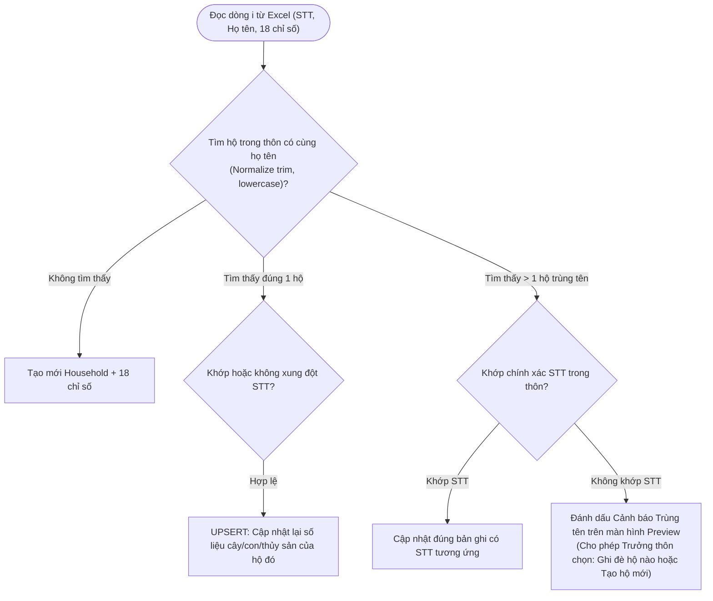

# TÀI LIỆU THIẾT KẾ KIẾN TRÚC VÀ NGHIỆP VỤ HỆ THỐNG QLNN
## Quản Lý Nông Nghiệp & Nông Thôn Mới - Xã Đăk Hà (Hệ sinh thái Dữ liệu Đăk Hà)

- **Ngày ban hành:** 16/08/2026
- **Trạng thái:** Bản thảo phê duyệt (Design Approved)
- **Ứng dụng:** QLNN (Quản Lý Nông Nghiệp)
- **Tương thích:** Hệ sinh thái Dữ liệu Đăk Hà (`DAKHA-ECOSYSTEM.md`), Dùng chung SSO Auth với `QLCS-Backend` (Cổng 5000)

---

## 1. TỔNG QUAN HỆ THỐNG & YÊU CẦU NGHIỆP VỤ

QLNN là ứng dụng số 2 trong Hệ sinh thái Dữ liệu Đăk Hà, phục vụ công tác thống kê, quản lý dữ liệu diện tích cây trồng, tổng đàn vật nuôi và diện tích/quy mô nuôi trồng thủy sản của từng hộ gia đình trên địa bàn các thôn thuộc xã Đăk Hà.

### 1.1. Phạm vi & Mục tiêu cốt lõi
1. **Quản lý hộ gia đình nông nghiệp:** Họ tên chủ hộ, thôn/làng, địa chỉ, số điện thoại, ghi chú.
2. **Quản lý 3 nhóm đối tượng thống kê (18 chỉ số):**
   - **Cây trồng (ha):** Cà phê (Hộ gia đình / Nhận khoán công ty), Cao su (Hộ gia đình / Nhận khoán công ty), Cây ăn quả, Cây Mắc Ca, Cây dược liệu (Đinh lăng, Gừng, Nghệ, Sả), Lúa nước, Cây hàng năm khác.
   - **Vật nuôi (con):** Trâu, Bò, Heo, Gia cầm.
   - **Thủy sản:** Nuôi cá ao (ha), Nuôi cá lồng bè (lồng).
3. **Biểu mẫu Excel 21 cột chuẩn hóa:** Import/Export 2 chiều giữ nguyên 100% định dạng biểu mẫu thật đang lưu hành tại xã Đăk Hà.
4. **Cơ chế chống trùng dữ liệu thông minh (Smart Upsert):** Hỗ trợ Trưởng thôn import lại file cập nhật nhiều lần mà không làm nhân đôi bản ghi, đồng thời cho phép phân biệt các hộ trùng tên thật.
5. **Dashboard Thống kê Nông thôn mới (NTM):** Báo cáo tổng hợp số liệu diện tích và đàn vật nuôi theo từng thôn và toàn xã.

---

## 2. QUY CHUẨN KIẾN TRÚC HỆ SINH THÁI ĐĂK HÀ

Hệ thống tuân thủ nghiêm ngặt 100% các tiêu chuẩn trong DAKHA-ECOSYSTEM.md:

1. **Shared SSO Auth & No Local Users Table:**
   - QLNN **KHÔNG tự tạo bảng `users`**.
   - QLNN-Backend dùng chung `JWT_SECRET` và `JWT_REFRESH_SECRET` với QLCS-Backend:
     ```env
     JWT_SECRET="qlcs_jwt_secret_2025_a8f3b7c9d4e1f2g6h5"
     JWT_REFRESH_SECRET="qlcs_jwt_refresh_2025_z9y8x7w6v5u4t3s2r1"
     ```
   - Middleware `authenticateToken` giải mã trực tiếp JWT payload chuẩn:
     ```typescript
     interface TokenPayload {
       id: string;          // UUID tài khoản từ QLCS
       username: string;    // admin, thon1, thon2...
       role: 'admin' | 'user'; // admin (Toàn xã), user (Trưởng thôn)
       village_id: string | null;
       iat: number;
       exp: number;
     }
     ```
   - Khi cần lấy thông tin chi tiết user hoặc avatar, gọi endpoint trung tâm: `GET http://localhost:5000/api/auth/me`.
2. **Health Check Endpoint:**
   - `GET /api/health` trả về trạng thái, uptime, version của QLNN-Backend.
3. **RBAC Scoping theo Thôn:**
   - `admin`: Truy cập toàn bộ dữ liệu tất cả các thôn.
   - `user` (Trưởng thôn): Backend tự động ép lọc theo `req.user.village_id`. Client tuyệt đối không tự gửi `village_id`.
4. **Bảo mật Token Client:**
   - Trong môi trường Electron Desktop, tokens được lưu qua `electron-store` (mã hóa cấp OS).
   - Session Timeout tự động đăng xuất sau 30 phút không hoạt động.

---

## 3. THIẾT KẾ CƠ SỞ DỮ LIỆU (DATABASE SCHEMA)

CSDL PostgreSQL độc lập cho QLNN (`QLNN-Backend/prisma/schema.prisma`):

```prisma
datasource db {
  provider   = "postgresql"
  url        = env("DATABASE_URL")
  directUrl  = env("DIRECT_URL")
  extensions = [pg_trgm, uuid_ossp(map: "uuid-ossp")]
}

generator client {
  provider        = "prisma-client-js"
  previewFeatures = ["postgresqlExtensions"]
}

model villages {
  id         String       @id @default(dbgenerated("gen_random_uuid()")) @db.Uuid
  name       String       @db.VarChar(255)
  created_at DateTime?    @default(now()) @db.Timestamptz
  households households[]
}

model households {
  id              String    @id @default(dbgenerated("gen_random_uuid()")) @db.Uuid
  village_id      String    @db.Uuid
  stt             Int?
  full_name       String    @db.VarChar(255)
  name_unaccented String?   @db.VarChar(255)
  phone           String?   @db.VarChar(20)
  address         String?   @db.VarChar(255)
  notes           String?   @default("")
  
  is_deleted      Boolean?  @default(false)
  deleted_at      DateTime? @db.Timestamptz
  created_at      DateTime? @default(now()) @db.Timestamptz
  updated_at      DateTime? @default(now()) @db.Timestamptz
  version         Int?      @default(1)

  village           villages            @relation(fields: [village_id], references: [id])
  crop_items        crop_items[]
  livestock_items   livestock_items[]
  aquaculture_items aquaculture_items[]

  @@index([village_id], map: "idx_households_village_id")
  @@index([village_id, full_name], map: "idx_households_village_name")
  @@index([is_deleted], map: "idx_households_is_deleted")
  @@index([name_unaccented(ops: raw("gin_trgm_ops"))], type: Gin, map: "idx_hh_name_unaccented_gin")
}

model crop_items {
  id              String      @id @default(dbgenerated("gen_random_uuid()")) @db.Uuid
  household_id    String      @db.Uuid
  crop_type       String      @db.VarChar(50) // "Cà phê", "Cao su", "Cây ăn quả", "Cây Mắc Ca", "Cây dược liệu", "Lúa nước", "Cây hàng năm khác"
  crop_subtype    String?     @db.VarChar(50) // "Đinh lăng", "Gừng", "Nghệ", "Sả" (chỉ cho Cây dược liệu)
  ownership_type  String?     @db.VarChar(20) // "household" (Hộ gia đình), "contracted" (Nhận khoán) - chỉ cho Cà phê & Cao su
  area            Decimal     @default(0) @db.Decimal(10, 3) // Đơn vị: ha

  household       households  @relation(fields: [household_id], references: [id], onDelete: Cascade)

  @@index([household_id], map: "idx_crops_household_id")
  @@index([crop_type], map: "idx_crops_type")
}

model livestock_items {
  id              String      @id @default(dbgenerated("gen_random_uuid()")) @db.Uuid
  household_id    String      @db.Uuid
  animal_type     String      @db.VarChar(50) // "Trâu", "Bò", "Heo", "Gia cầm"
  quantity        Int         @default(0)     // Đơn vị: con

  household       households  @relation(fields: [household_id], references: [id], onDelete: Cascade)

  @@index([household_id], map: "idx_livestock_household_id")
  @@index([animal_type], map: "idx_livestock_type")
}

model aquaculture_items {
  id                String      @id @default(dbgenerated("gen_random_uuid()")) @db.Uuid
  household_id      String      @db.Uuid
  aquaculture_type  String      @db.VarChar(50) // "Nuôi cá ao", "Nuôi cá lồng bè"
  value             Decimal     @default(0) @db.Decimal(10, 3) // Diện tích ao (ha) hoặc số lồng bè (lồng)
  unit              String      @db.VarChar(20) // "ha" hoặc "lồng"

  household         households  @relation(fields: [household_id], references: [id], onDelete: Cascade)

  @@index([household_id], map: "idx_aqua_household_id")
  @@index([aquaculture_type], map: "idx_aqua_type")
}

model audit_logs {
  id         String    @id @default(dbgenerated("gen_random_uuid()")) @db.Uuid
  user_id    String?   @db.Uuid
  village_id String?   @db.Uuid
  action     String
  details    String?
  created_at DateTime? @default(now()) @db.Timestamptz
}
```

---

## 4. MA TRẬN 21 CỘT VÀ CHIẾN LƯỢC IMPORT/EXPORT EXCEL

### 4.1. Bảng đối chiếu 21 cột

| Cột | Tên trên biểu mẫu gốc | Nhóm | Trường ánh xạ | Kiểu & Đơn vị |
|:---:|---|---|---|:---:|
| **0 (A)** | **STT** | Thông tin chung | `households.stt` | Số nguyên |
| **1 (B)** | **Họ và tên** | Thông tin chung | `households.full_name` | Chuỗi ký tự |
| **2 (C)** | Cà phê - Hộ gia đình | Cây trồng | `crop_items (crop_type: "Cà phê", ownership_type: "household")` | Thập phân (ha) |
| **3 (D)** | Cà phê - Nhận khoán (công ty) | Cây trồng | `crop_items (crop_type: "Cà phê", ownership_type: "contracted")` | Thập phân (ha) |
| **4 (E)** | Cao su - Hộ gia đình | Cây trồng | `crop_items (crop_type: "Cao su", ownership_type: "household")` | Thập phân (ha) |
| **5 (F)** | Cao su - Nhận khoán (công ty) | Cây trồng | `crop_items (crop_type: "Cao su", ownership_type: "contracted")` | Thập phân (ha) |
| **6 (G)** | Cây ăn quả | Cây trồng | `crop_items (crop_type: "Cây ăn quả")` | Thập phân (ha) |
| **7 (H)** | Cây Mắc Ca | Cây trồng | `crop_items (crop_type: "Cây Mắc Ca")` | Thập phân (ha) |
| **8 (I)** | Dược liệu - Đinh lăng | Cây trồng | `crop_items (crop_type: "Cây dược liệu", crop_subtype: "Đinh lăng")` | Thập phân (ha) |
| **9 (J)** | Dược liệu - Gừng | Cây trồng | `crop_items (crop_type: "Cây dược liệu", crop_subtype: "Gừng")` | Thập phân (ha) |
| **10 (K)** | Dược liệu - Nghệ | Cây trồng | `crop_items (crop_type: "Cây dược liệu", crop_subtype: "Nghệ")` | Thập phân (ha) |
| **11 (L)** | Dược liệu - Sả | Cây trồng | `crop_items (crop_type: "Cây dược liệu", crop_subtype: "Sả")` | Thập phân (ha) |
| **12 (M)** | Lúa nước | Cây trồng | `crop_items (crop_type: "Lúa nước")` | Thập phân (ha) |
| **13 (N)** | Cây hàng năm khác | Cây trồng | `crop_items (crop_type: "Cây hàng năm khác")` | Thập phân (ha) |
| **14 (O)** | Trâu | Vật nuôi | `livestock_items (animal_type: "Trâu")` | Số nguyên (con) |
| **15 (P)** | Bò | Vật nuôi | `livestock_items (animal_type: "Bò")` | Số nguyên (con) |
| **16 (Q)** | Heo | Vật nuôi | `livestock_items (animal_type: "Heo")` | Số nguyên (con) |
| **17 (R)** | Gia cầm | Vật nuôi | `livestock_items (animal_type: "Gia cầm")` | Số nguyên (con) |
| **18 (S)** | Nuôi cá ao | Thủy sản | `aquaculture_items (aquaculture_type: "Nuôi cá ao", unit: "ha")` | Thập phân (ha) |
| **19 (T)** | Nuôi cá lồng bè | Thủy sản | `aquaculture_items (aquaculture_type: "Nuôi cá lồng bè", unit: "lồng")` | Số nguyên (lồng) |
| **20 (U)** | **Ghi chú** | Thông tin chung | `households.notes` | Chuỗi ký tự |

### 4.2. Cơ chế Chống trùng lặp & Xử lý Trùng tên (Deduplication & Safe Upsert)



- **Mặc định khi Import:**
  - Nếu tên hộ đã tồn tại trong thôn $\to$ Tự động cập nhật (Upsert) số liệu mới nhất, không tạo thêm dòng rác.
  - Hỗ trợ màn hình **Import Preview Diff** (hiển thị danh sách: Bao nhiêu hộ mới, Bao nhiêu hộ cập nhật số liệu, Bao nhiêu hộ có cảnh báo trùng tên).
  - Sử dụng **Dynamic Import (`await import('xlsx-js-style')`)** trong Client để chống crash màn hình trắng trong Electron.

---

## 5. CẤU TRÚC THƯ MỤC VÀ TÁI SỬ DỤNG MÃ NGUỒN

### 5.1. QLNN-Backend (`C:\Projects\QLNN\QLNN-Backend`)
- `package.json`, `tsconfig.json`, `.env` (PORT=5001, DATABASE_URL, JWT_SECRET, CORS_ORIGIN)
- `prisma/schema.prisma`
- `src/`
  - `config/prisma.ts`, `config/jwt.ts`
  - `middlewares/auth.middleware.ts` (JWT verification, `authorizeVillageScope`)
  - `controllers/`
    - `health.controller.ts` (`GET /api/health`)
    - `household.controller.ts` (CRUD, Search, Cursor Pagination)
    - `analytics.controller.ts` (Thống kê Nông thôn mới theo thôn & toàn xã)
    - `excel.controller.ts` (Import/Export chuẩn 21 cột)
  - `routes/` (health, households, analytics, excel, villages)
  - `utils/excelParser.ts`, `utils/excelBuilder.ts`
  - `index.ts`

### 5.2. QLNN-Client (`C:\Projects\QLNN\QLNN-Client`)
- Tái sử dụng từ `QLCS-Client`:
  - `electron/` (main, preload, secureStorage, auto-updater)
  - `src/components/Layout/` (Header, Sidebar, UserMenu)
  - `src/components/ErrorBoundary.tsx`, `UpdaterToast.tsx`, `Pagination.tsx`
  - `src/hooks/useModal.tsx`, `useFormValidation.ts`
  - `src/AppContext.tsx` (Auth SSO, kết nối API port 5001)
  - `vite.config.ts` (kèm `vite-plugin-node-polyfills`)
- Viết mới cho nghiệp vụ Nông nghiệp:
  - `src/pages/Dashboard/components/SpreadsheetTable.tsx` (Bảng hiển thị 21 cột responsive, sticky col STT & Họ tên)
  - `src/pages/Dashboard/components/NTMDashboard.tsx` (Biểu đồ diện tích cây trồng, tổng đàn vật nuôi, tỷ trọng cà phê/cao su hộ vs công ty)
  - `src/pages/Dashboard/modals/AddHouseholdModal.tsx` & `EditHouseholdModal.tsx` (Form 3 tabs: Cây trồng, Vật nuôi, Thủy sản)
  - `src/pages/Dashboard/modals/ExcelImportModal.tsx` & `ExcelExportModal.tsx` (Xem trước thay đổi, xuất file đúng định dạng 21 cột)
  - `src/pages/Dashboard/modals/HouseholdDetailModal.tsx` (Xem chi tiết hồ sơ nông nghiệp của hộ)

---

## 6. KẾ HOẠCH XÁC THỰC VÀ KIỂM THỬ (VERIFICATION PLAN)

1. **Kiểm thử API Health & Auth:**
   - `GET http://localhost:5001/api/health` trả về status `ok`.
   - Gửi request không token $\to$ 401.
   - Gửi token Trưởng thôn `thon1` $\to$ chỉ truy vấn được dữ liệu của Thôn 1.
   - Gửi token `admin` $\to$ truy vấn được toàn bộ xã Đăk Hà.
2. **Kiểm thử CSDL & Upsert:**
   - Thêm mới hộ $\to$ kiểm tra quan hệ `crop_items`, `livestock_items`, `aquaculture_items` được lưu chính xác.
   - Import lại chính file Excel $\to$ không tạo thêm dòng mới, cập nhật chính xác các trường số liệu.
3. **Kiểm thử Import/Export Excel với file thật:**
   - Import file `Biểu mẫu thống kê câ trồng, vật nuôi, thủy sản.xls`.
   - Export dữ liệu ra file `.xlsx` $\to$ mở kiểm tra cấu trúc 21 cột, header 3 dòng, merges, formulas tổng.
4. **Kiểm thử Build Electron & Web:**
   - `npm run build:vite` trong QLNN-Client biên dịch thành công 0 lỗi.
   - Chạy Electron desktop app mượt mà, không bị lỗi màn hình trắng.
