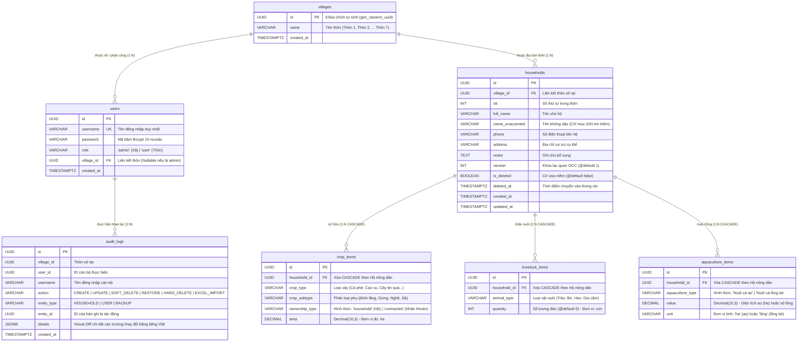
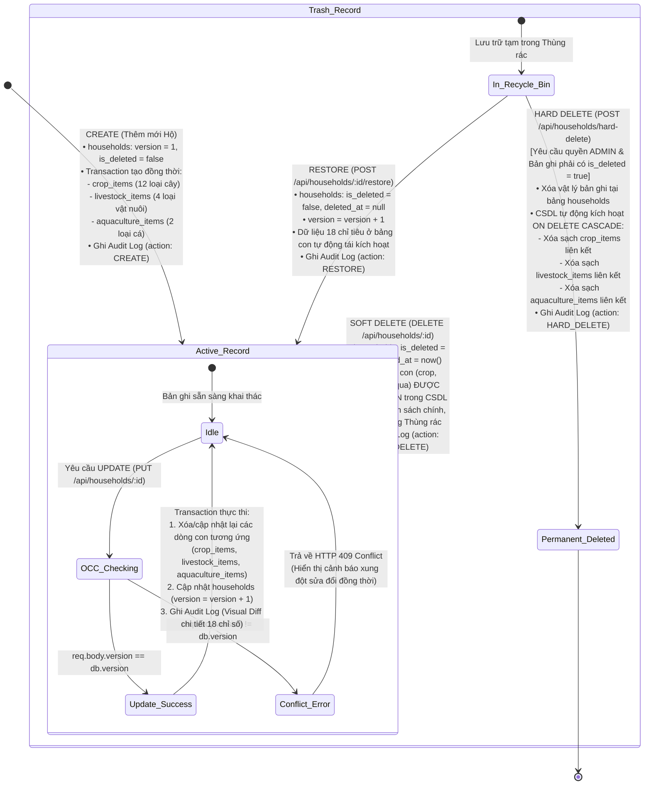

# BẢN ĐỒ KIẾN TRÚC TOÀN DIỆN & SỔ TAY KỸ THUẬT HỆ THỐNG QLNN
## (QLNN MASTER ARCHITECTURE MAP & TECHNICAL SPECIFICATION)

> **Dự án:** Phân hệ Quản lý Nông nghiệp & Nông thôn mới (Hệ sinh thái Số hóa Xã Đăk Hà)  
> **Workspace:** `c:\Projects\QLNN`  
> **Phiên bản tài liệu:** `1.1.0 (Centered Modal & Unified UI Standard)` | **Ngày cập nhật:** `2026-09-17`  
> **Trạng thái hệ thống:** Sẵn sàng bảo trì & phát triển | Test Fortress 100% Pass (6 Suites / 19 Tests Client + 4 Suites / 23 Tests Backend). Chuẩn hóa Modal Nổi Trung Tâm (HouseholdModal) với createPortal – Khai tử hoàn toàn Slide-Over Drawer.

---

## 1. TỔNG QUAN HỆ SINH THÁI & VỊ THẾ CỦA QLNN

### 1.1. Triết lý Vận hành & Phân quyền Độc lập
Hệ thống chuyển đổi số và quản lý dữ liệu xã Đăk Hà vận hành theo nguyên tắc bất biến:
> **"ĐỘC LẬP CHUYÊN NGÀNH – ĐỊNH DANH RIÊNG BIỆT – HỢP NHẤT DỮ LIỆU"**  
> *(Specialized Independence – Separate Identity – Unified Data)*

- **Nhiệm vụ chuyên môn của phân hệ QLNN:** Thống kê, giám sát và quản lý biến động **18 chỉ tiêu nông nghiệp** (12 cây trồng, 4 chăn nuôi, 2 thủy sản) của từng hộ dân nông nghiệp trên địa bàn 7 thôn/làng trực thuộc xã Đăk Hà. Cung cấp công cụ xuất/nhập Excel 21 cột thông minh (Smart-Upsert), cảnh báo xung đột dữ liệu tức thời (OCC), và phân tích biểu đồ trực quan phục vụ công tác chỉ đạo nông nghiệp, nông thôn mới của UBND xã.
- **Cổng Hợp nhất (Unified Portal):** Người dùng có thể điều hướng từ Landing Portal trung tâm `dulieudakha.vn` hoặc chạy trực tiếp phần mềm Desktop chuyên dụng trên máy trạm của cán bộ nông nghiệp xã và các trưởng thôn.

### 1.2. Các Quy chuẩn Bất biến Toàn Hệ sinh thái (Architectural Invariants)
1. **Zero Centralized SSO Dependency (Độc lập xác thực 100%):**
   - QLNN sở hữu Database PostgreSQL riêng (`dakha_qlnn`), bảng `users` riêng, và JWT Secret riêng (`JWT_SECRET` độc lập).
   - Tuyệt đối không gọi chéo runtime sang các phân hệ khác (`QLCS`, `QLHK`) để xác thực hoặc phân quyền. Không chia sẻ database connection string giữa các phân hệ.
2. **Cô lập Cổng Mạng (Port & Domain Isolation):**
   - **Backend REST API:** Cổng `5001` (Production: `https://qlnn.dulieudakha.vn/api`).
   - **Client Desktop / Dev Renderer:** Cổng `5174` (Domain: `https://qlnn.dulieudakha.vn`).
   *(Bảng tham chiếu cổng mạng toàn hệ sinh thái: QLCS = 5000/5173 | QLNN = 5001/5174 | QLHK = 5002/5175)*.
3. **Chuẩn hóa Payload JWT Token (`TokenPayload`):**
   ```typescript
   export interface TokenPayload {
     id: string;                // UUID người dùng
     username: string;          // Tên đăng nhập (admin, thon1, thon2...)
     role: 'admin' | 'user';    // 'admin' (Cán bộ xã) | 'user' (Trưởng thôn)
     village_id: string | null; // UUID Thôn (Bắt buộc null nếu role='admin')
     iat?: number;
     exp?: number;
   }
   ```
4. **Cô lập Dữ liệu Cấp Thôn (Village Scoping RBAC Contract):**
   - **Role `admin` (Cán bộ Xã):** Xem toàn bộ 7 thôn, lọc thôn tùy biến, có quyền xóa vĩnh viễn và quản lý sao lưu.
   - **Role `user` (Trưởng thôn):** Backend bắt buộc cưỡng chế lọc dữ liệu theo `req.user.village_id` trích xuất từ JWT. Client tuyệt đối không gửi `village_id` của thôn khác lên server (vi phạm sẽ bị chặn `403 Forbidden`).

### 1.3. Sơ đồ Topology 2 Tầng của Phân hệ QLNN

```
                          +-------------------------------------------------------------+
                          |                 PHÂN HỆ QLNN - XÃ ĐĂK HÀ                    |
                          +-------------------------------------------------------------+
                                                         |
                   +-------------------------------------+-------------------------------------+
                   |                                                                           |
                   v                                                                           v
+-------------------------------------------------------+   +-------------------------------------------------------+
|            QLNN-CLIENT (Desktop Electron App)         |   |             QLNN-BACKEND (Express REST API)           |
| Thư mục: c:\Projects\QLNN\QLNN-Client                 |   | Thư mục: c:\Projects\QLNN\QLNN-Backend                |
| Port dev: 5174 | Domain: qlnn.dulieudakha.vn          |   | Port dev: 5001 | Domain: qlnn.dulieudakha.vn/api      |
+-------------------------------------------------------+   +-------------------------------------------------------+
| 1. Electron Main Process (electron/main.ts):          |   | 1. Express + TypeScript Server (src/index.ts):        |
|    - Cửa sổ BrowserWindow, IPC Zoom 80% - 140%        |   |    - Routing phân tầng, Zod validation, Error handler |
|    - AES Encrypted secureStore (electron-store)       |   | 2. Security & Auth Engine:                            |
|    - IPC Bridge hai chiều Renderer <-> Main           |   |    - JWT Bearer Authentication (Hạn 7 ngày)           |
| 2. React + Vite Renderer (src/):                      |   |    - Middlewares: authenticateToken, village scoping  |
|    - Giao diện TailwindCSS 4, Dark/Light Mode         |   | 3. Prisma ORM + PostgreSQL (dakha_qlnn):              |
|    - Quản lý State tập trung qua AppContext.tsx       |   |    - Khóa lạc quan Optimistic Locking (version: Int)  |
|    - Tự động đăng xuất sau 30 phút không tương tác    |   |    - Xóa mềm (is_deleted: true, deleted_at)           |
|    - Heartbeat monitor kiểm tra Backend mỗi 6 giây    |   |    - Quan hệ Cascade sang 3 bảng con chỉ tiêu         |
|    - Dexie (IndexedDB): Cache danh sách ngoại tuyến   |   |    - GIN Trigram index tìm kiếm tiếng Việt siêu tốc   |
|    - Dynamic Import: await import('xlsx-js-style')    |   | 4. Background Services & Cron Jobs:                   |
|    - Axios Interceptors: Tự động điều hướng khi 401   |   |    - Cron backup CSDL tự động lúc 02:00 AM mỗi ngày   |
+-------------------------------------------------------+   +-------------------------------------------------------+
```

---

## 2. BẢN ĐỒ CẤU TRÚC THƯ MỤC & VAI TRÒ TỪNG TỆP TIN

### 2.1. Cấu trúc Thư mục Backend (`QLNN-Backend`)

```
QLNN-Backend/
├── .env                                # Biến môi trường (DATABASE_URL, DIRECT_URL, JWT_SECRET, PORT=5001)
├── .env.example                        # Mẫu cấu hình môi trường chuẩn
├── package.json                        # Khai báo dependencies (express, prisma, bcryptjs, jsonwebtoken, node-cron, exceljs...)
├── tsconfig.json                       # Cấu hình TypeScript compiler
├── jest.config.js                      # Cấu hình kiểm thử tự động Jest (ts-jest)
├── CLAUDE.md                           # Quy tắc bất biến dự án, cấm tạo file vá tạm, quy chuẩn mã nguồn
├── prisma/
│   └── schema.prisma                   # Khai báo 7 models CSDL (households, 3 bảng con, villages, users, audit_logs)
├── scripts/                            # Scripts khởi tạo hệ thống và kiểm thử ca biên
│   ├── seed-villages.ts                # Khởi tạo danh mục 7 thôn/làng xã Đăk Hà
│   ├── seed-users.ts                   # Khởi tạo tài khoản admin và cán bộ 7 thôn
│   └── verify-excel-parser-edge-cases.ts # Kiểm thử các ca biên: dòng trống, dữ liệu âm, chuỗi lỗi
├── test-fixtures/
│   └── test_dulieu_thon1_dien_that.xlsx # File Excel mẫu thực tế chứa dữ liệu thôn 1 để chạy kiểm thử
├── tests/                              # Pháo đài kiểm thử tự động Integration Tests
│   ├── setup.ts                        # Thiết lập môi trường test, mock hoặc kết nối CSDL test
│   └── integration/
│       ├── auth.test.ts                # Test đăng nhập, cấp token, sai mật khẩu, chặn thiếu token
│       ├── village.test.ts             # Test danh mục thôn, chặn user thường sửa thôn, cấp quyền admin
│       ├── audit.test.ts               # Test ghi nhật ký Audit Log, kiểm tra JSON diff thay đổi dữ liệu
│       └── household.test.ts           # Test CRUD hộ, Optimistic Lock 409, Xóa mềm, Khôi phục, Xóa vĩnh viễn
└── src/
    ├── index.ts                        # Điểm khởi động Express server, CORS, Helmet, nạp routes, kích hoạt cron
    ├── config/
    │   ├── jwt.ts                      # Cấu hình JWT secret, thời hạn token (7 ngày)
    │   └── prisma.ts                   # Khởi tạo PrismaClient singleton kết nối PostgreSQL
    ├── controllers/                    # Tầng điều khiển nghiệp vụ (Business Logic Controllers)
    │   ├── auth.controller.ts          # Đăng nhập cán bộ, so khớp bcrypt password, sinh JWT token
    │   ├── household.controller.ts     # CRUD Hộ nông dân, tính toán OCC version, serialize 18 chỉ số, soft/hard delete
    │   ├── analytics.controller.ts     # DỊCH VỤ TÍNH TOÁN 18 CHỈ TIÊU NÔNG NGHIỆP toàn xã và theo từng thôn
    │   ├── excel.controller.ts         # Quản lý xuất Excel báo cáo, tải template, tiếp nhận và điều phối Smart-Upsert
    │   ├── village.controller.ts       # Quản lý danh mục thôn/làng, tổng hợp số hộ và diện tích theo thôn
    │   ├── user.controller.ts          # Quản trị tài khoản cán bộ thôn, cấp lại mật khẩu, phân công địa bàn
    │   ├── audit.controller.ts         # Truy vấn nhật ký kiểm toán, lọc theo thôn, định dạng diff tiếng Việt
    │   ├── backup.controller.ts        # Thực hiện snapshot CSDL PostgreSQL, tạo bản sao lưu, khôi phục dữ liệu
    │   └── health.controller.ts        # Endpoint kiểm tra sức khỏe hệ thống và kết nối CSDL PostgreSQL
    ├── crons/                          # Tác vụ nền định kỳ (Scheduled Background Workers)
    │   └── backup.cron.ts              # CRON TỰ ĐỘNG SAO LƯU CSDL LÚC 02:00 AM HÀNG NGÀY (node-cron: 0 2 * * *)
    ├── middlewares/
    │   └── auth.middleware.ts          # authenticateToken + authorizeVillageScope + authorizeAdmin
    ├── routes/                         # Định tuyến Express REST API
    │   ├── auth.routes.ts              # /api/auth (login)
    │   ├── household.routes.ts         # /api/households (CRUD, recycle-bin, restore, hard-delete)
    │   ├── analytics.routes.ts         # /api/analytics (summary, export)
    │   ├── excel.routes.ts             # /api/excel (template, import, export)
    │   ├── village.routes.ts           # /api/villages (danh mục thôn)
    │   ├── user.routes.ts              # /api/users (quản lý tài khoản)
    │   ├── audit.routes.ts             # /api/audit-logs (lịch sử biến động)
    │   ├── backup.routes.ts            # /api/backups (sao lưu & khôi phục)
    │   └── health.routes.ts            # /api/health (kiểm tra uptime)
    ├── services/
    │   └── userActivity.service.ts     # Ghi nhận thời điểm hoạt động gần nhất của người dùng
    └── utils/
        ├── excelParser.ts              # ĐỘNG CƠ BÓC TÁCH 21 CỘT EXCEL (bỏ qua 9 dòng đầu, lọc dòng ma, Smart-Upsert)
        ├── excelBuilder.ts             # ĐỘNG CƠ XUẤT EXCEL ĐỊNH DẠNG CHUẨN (tạo sheet 18 chỉ tiêu, kẻ khung, căn lề)
        └── textUtils.ts                # Chuẩn hóa chuỗi tiếng Việt không dấu (removeAccents) phục vụ tìm kiếm
```

### 2.2. Cấu trúc Thư mục Client (`QLNN-Client`)

```
QLNN-Client/
├── package.json                        # Dependencies (React 18, Vite 5, Electron 42, TailwindCSS 4, Lucide, Recharts, Dexie)
├── vite.config.ts                      # Cấu hình Vite build, proxy API dev port 5001
├── vitest.config.ts                    # Cấu hình kiểm thử React Testing Library với jsdom
├── tsconfig.json                       # Cấu hình TypeScript cho React Renderer
├── tsconfig.node.json                  # Cấu hình TypeScript cho Vite và Electron main
├── tailwind.config.js                  # Cấu hình màu sắc theme Đăk Hà (xanh lá nông nghiệp, dark mode)
├── postcss.config.js                   # Cấu hình PostCSS
├── index.html                          # Template HTML gốc gắn React App
├── CLAUDE.md                           # Quy chuẩn Client, cấm top-level import Excel, quy tắc bảo mật token
├── electron/                           # Tầng Electron Main Process (Desktop Platform Layer)
│   ├── main.ts                         # Khởi tạo BrowserWindow, phím tắt Zoom (80%-140%), IPC handlers bảo mật
│   ├── preload.ts                      # ContextBridge phơi bày API an toàn (zoom, secure storage) ra Renderer
│   └── electron-env.d.ts               # Khai báo TypeScript definitions cho Window IPC
└── src/                                # Tầng React Renderer Process
    ├── App.tsx                         # Điều hướng React Router, bọc AppProvider, định tuyến bảo vệ theo role
    ├── AppContext.tsx                  # Quản lý State toàn cục: user, token, theme, zoom, 30m auto-logout, heartbeat
    ├── main.tsx                        # Entry point React DOM render
    ├── index.css                       # Tailwind CSS directives, tùy biến thanh cuộn, giao diện Dark/Light
    ├── api/                            # Tầng giao tiếp HTTP với QLNN-Backend
    │   ├── apiClient.ts                # Axios instance, Bearer token interceptor, xử lý lỗi 401 & 409
    │   ├── authApi.ts                  # Gọi API đăng nhập, kiểm tra phiên
    │   ├── householdApi.ts             # Gọi API CRUD hộ, phân trang, tìm kiếm, thùng rác, khôi phục, xóa vĩnh viễn
    │   ├── analyticsApi.ts             # Gọi API lấy số liệu tổng hợp 18 chỉ tiêu toàn xã và theo thôn
    │   ├── excelApi.ts                 # Tải template, gửi file import, tải file xuất báo cáo
    │   ├── villageApi.ts               # Lấy danh mục thôn, thêm/sửa thôn (Admin)
    │   └── auditApi.ts                 # Lấy danh sách nhật ký kiểm toán biến động
    ├── components/                     # Hệ thống Components giao diện người dùng
    │   ├── households/                 # CÁC COMPONENT QUẢN LÝ HỘ NÔNG NGHIỆP
    │   │   ├── HouseholdTable.tsx      # Bảng hiển thị 18 chỉ tiêu nông nghiệp, phân trang, nút xem/sửa/xóa
    │   │   ├── HouseholdModal.tsx      # Modal Nổi Trung Tâm (Centered Floating Dialog) bọc qua createPortal, fixed header với tab switch (Cây trồng, Vật nuôi, Thủy sản), scrollable body 18 chỉ tiêu, fixed footer, phát hiện trùng tên hộ 409
    │   │   ├── HouseholdFilterBar.tsx  # Thanh lọc theo thôn, ô tìm kiếm tiếng Việt không dấu, nút xuất dữ liệu
    │   │   └── RecycleBinTable.tsx     # Bảng dữ liệu thùng rác, nút khôi phục, nút xóa vĩnh viễn (Admin)
    │   ├── analytics/                  # CÁC COMPONENT BÁO CÁO THỐNG KÊ
    │   │   └── AnalyticsDashboard.tsx  # Dashboard biểu đồ Recharts (cơ cấu cây trồng, đàn gia súc, so sánh giữa 7 thôn)
    │   ├── excel/                      # CÁC COMPONENT NHẬP / XUẤT EXCEL
    │   │   ├── ExportSettingsModal.tsx # Cấu hình tùy chọn xuất dữ liệu (chọn thôn, chọn nhóm chỉ tiêu xuất ra)
    │   │   └── ImportPreviewModal.tsx  # Xem trước dữ liệu bóc tách từ file Excel, cảnh báo dòng lỗi trước khi lưu
    │   ├── audit/
    │   │   └── AuditLogView.tsx        # Bảng hiển thị toàn bộ Audit Log kèm Visual Diff (xanh thêm mới, đỏ xóa bỏ)
    │   ├── auth/
    │   │   └── LoginView.tsx           # Form đăng nhập cán bộ, kiểm tra trường trống, hiển thị lỗi xác thực
    │   ├── Layout/
    │   │   ├── AppLayout.tsx           # Khung bố cục chuẩn (Sidebar cố định bên trái, Header trên, Content chính)
    │   │   ├── Header.tsx              # Thanh tiêu đề, thông tin cán bộ đăng nhập, nút đổi theme, nút đăng xuất
    │   │   └── Sidebar.tsx             # Menu điều hướng các chức năng: Hộ dân, Thống kê, Excel, Thùng rác, Lịch sử...
    │   ├── network/
    │   │   ├── ConnectionBanner.tsx    # Banner màu vàng cảnh báo khi mất kết nối mạng hoặc Backend dừng
    │   │   └── ServerStatusModal.tsx   # Hộp thoại chi tiết trạng thái kết nối máy chủ và thời gian trễ (latency)
    │   ├── settings/
    │   │   └── BackupRestoreTab.tsx    # Giao diện tạo bản sao lưu CSDL và phục hồi dữ liệu cho Admin
    │   └── common/
    │       ├── ErrorBoundary.tsx       # Bắt lỗi sập React UI, hiển thị giao diện phục hồi thân thiện
    │       └── TablePagination.tsx     # Bộ điều khiển phân trang dùng chung (Trang trước, Trang sau, Số dòng/trang)
    ├── db/
    │   └── indexedDB.ts                # Bộ nhớ đệm ngoại tuyến Dexie: cache danh sách hộ hiển thị tức thì
    ├── hooks/
    │   ├── useDebounce.ts              # Hoãn tìm kiếm khi người dùng gõ tên chủ hộ
    │   ├── useInactivityTimeout.ts     # Tự động đăng xuất sau 30 phút không di chuyển chuột/gõ phím
    │   └── useModal.tsx                # Quản lý trạng thái mở/đóng các hộp thoại Modal
    ├── pages/                          # Các màn hình chức năng chính
    │   ├── HouseholdsPage.tsx          # Màn hình chính quản lý danh sách hộ nông nghiệp và 18 chỉ tiêu
    │   ├── AnalyticsPage.tsx           # Màn hình báo cáo trực quan, biểu đồ tăng trưởng cây trồng - vật nuôi
    │   ├── ExcelPage.tsx               # Màn hình tải file mẫu, kéo thả nhập file Excel và xuất dữ liệu
    │   ├── RecycleBinPage.tsx          # Màn hình quản lý thùng rác (dành cho cả User và Admin)
    │   ├── VillagesPage.tsx            # Màn hình quản lý danh mục thôn (chỉ dành cho Admin)
    │   └── SettingsPage.tsx            # Màn hình cài đặt hệ thống, cấu hình và sao lưu dữ liệu
    ├── tests/                          # Pháo đài kiểm thử tự động Vitest + React Testing Library
    │   ├── setup.ts                    # Cấu hình môi trường test jsdom, mock window.api và localStorage
    │   └── components/
    │       ├── Auth.test.tsx           # Kiểm thử LoginView: validate form, submit thành công, hiển thị thông báo lỗi
    │       ├── AuditLogView.test.tsx   # Kiểm thử AuditLogView: hiển thị diff dữ liệu có nhãn tiếng Việt rõ ràng
    │       ├── HouseholdForm.test.tsx  # Kiểm thử nhập liệu 18 chỉ số: validate số âm, gửi đúng cấu trúc DTO
    │       └── RecycleBin.test.tsx     # Kiểm thử RecycleBinTable: hiển thị bản ghi đã xóa, nút khôi phục và xóa vĩnh viễn
    ├── types/
    │   └── index.ts                    # Định nghĩa interfaces TypeScript toàn diện: Household, 18 metrics, User, Village...
    └── utils/
        ├── cryptoHelper.ts             # Các hàm tiện ích băm và mã hóa phụ trợ
        └── secureStorage.ts            # Đọc/ghi token bảo mật qua Electron Store mã hóa AES cấp hệ điều hành
```

---

## 3. KIẾN TRÚC DỮ LIỆU & BẢO MẬT (DATABASE, PRISMA ORM & SECURITY)

### 3.1. Sơ đồ Thực thể - Quan hệ (Mermaid ER Diagram)

Database: PostgreSQL (`dakha_qlnn`)  
ORM: Prisma (`QLNN-Backend/prisma/schema.prisma`)  
Hệ thống chuẩn hóa trên **7 models** quan hệ chặt chẽ:



### 3.2. 5 Quy chuẩn CSDL Cốt lõi của QLNN
1. **Khóa Lạc Quan (Optimistic Concurrency Control - OCC):**
   - Bảng `households` bắt buộc duy trì cột `version: Int? @default(1)`.
   - Lệnh `PUT /api/households/:id` bắt buộc gửi kèm `version`. Nếu `req.body.version !== db.version` -> Server lập tức trả về `409 Conflict`. Cập nhật thành công -> `version` tự động tăng `+1`.
2. **Cơ Chế Xóa 2 Lớp (Soft Delete & Recycle Bin):**
   - Xóa thông thường chuyển thành `is_deleted = true, deleted_at = now()`.
   - Bản ghi chuyển vào Thùng rác để cán bộ thôn và xã có thể khôi phục (`RESTORE`).
   - Xóa vĩnh viễn (`HARD_DELETE`) chỉ cấp phép cho tài khoản `admin` và bắt buộc bản ghi đã nằm trong thùng rác (`is_deleted: true`).
3. **Cascade Delete Toàn Vẹn Cha - Con (Parent-Child Integrity):**
   - Cả 3 bảng con `crop_items`, `livestock_items`, `aquaculture_items` đều cấu hình `onDelete: Cascade` liên kết trực tiếp với `households.id`. Khi một hộ bị xóa vĩnh viễn khỏi CSDL, PostgreSQL và Prisma tự động dọn sạch mọi bản ghi con mà không cần xóa thủ công từng bảng.
4. **Tìm Kiếm Tiếng Việt Siêu Tốc Bằng GIN Trigram:**
   - Cột `name_unaccented` được chuẩn hóa tự động qua hàm `removeAccents()` khi tạo hoặc cập nhật hộ dân.
   - CSDL kích hoạt extension `pg_trgm` và đánh chỉ mục GIN trên `name_unaccented`, cho phép tìm kiếm chính xác và tìm kiếm mờ tên chủ hộ không dấu với độ trễ < 5ms trên tập dữ liệu hàng chục nghìn hộ.
5. **Kiểm Toán Biến Động Dữ Liệu Chi Tiết (Audit Trail):**
   - Mọi thay đổi dữ liệu (tạo mới, sửa đổi, xóa tạm, khôi phục, import) đều được ghi vào bảng `audit_logs`.
   - Cột `details` lưu trữ danh sách các trường thay đổi kèm giá trị cũ và mới, được serialize bằng nhãn tiếng Việt trực quan (ví dụ: `Cà phê - Hộ (ha)`, `Bò (con)`).

---

## 4. KIẾN TRÚC BACKEND & HỢP ĐỒNG API (BACKEND SERVICES & RBAC CONTRACTS)

### 4.1. Ma trận API Chuẩn (Port 5001)

| Phân nhóm | Method | Đường dẫn Route | Yêu cầu Quyền | Mục đích Nghiệp vụ |
|---|---|---|---|---|
| **Hệ thống** | `GET` | `/api/health` | Public | Kiểm tra kết nối Backend, Uptime, trạng thái CSDL PostgreSQL |
| **Xác thực** | `POST` | `/api/auth/login` | Public | Đăng nhập cán bộ bằng username/password, cấp JWT Token hạn 7 ngày |
| **Quản trị User**| `GET` | `/api/users` | Admin Only | Xem danh sách cán bộ thôn trên địa bàn xã |
| | `POST` | `/api/users` | Admin Only | Tạo tài khoản cán bộ thôn mới kèm `village_id` |
| | `PUT` | `/api/users/:id` | Admin Only | Đổi mật khẩu, sửa thông tin cán bộ, phân công lại thôn |
| | `DELETE`| `/api/users/:id` | Admin Only | Xóa tài khoản cán bộ |
| **Thôn / Làng** | `GET` | `/api/villages` | Authenticated | Lấy danh mục 7 thôn kèm thống kê tổng số hộ (User bị ép theo thôn) |
| | `POST` | `/api/villages` | Admin Only | Thêm thôn mới vào hệ thống |
| | `PUT` | `/api/villages/:id` | Admin Only | Đổi tên thôn / cập nhật thông tin |
| | `DELETE`| `/api/villages/:id` | Admin Only | Xóa thôn (chỉ khi không còn hộ nào thuộc thôn) |
| **Hộ Nông Dân** | `GET` | `/api/households` | Village Scoped | Danh sách hộ (Phân trang, tìm kiếm tiếng Việt, lọc thôn) |
| | `GET` | `/api/households/:id` | Village Scoped | Chi tiết 1 hộ nông dân kèm 18 chỉ tiêu nông nghiệp |
| | `POST` | `/api/households` | Village Scoped | Thêm mới hộ và 18 chỉ số (tự động gắn `village_id` nếu là user) |
| | `PUT` | `/api/households/:id` | Village Scoped | Cập nhật hộ & chỉ tiêu (Bắt buộc kiểm tra OCC `version`) |
| | `DELETE`| `/api/households/:id` | Village Scoped | Xóa mềm hộ vào Thùng rác (`is_deleted = true`) |
| **Thùng Rác** | `GET` | `/api/households/recycle-bin/list` | Village Scoped | Xem danh sách các hộ nông dân đã bị xóa tạm |
| | `POST` | `/api/households/:id/restore` | Village Scoped | Khôi phục hộ từ thùng rác về danh sách hoạt động |
| | `POST` | `/api/households/hard-delete` | Admin Only | Xóa vĩnh viễn danh sách hộ được chọn (chỉ xóa hộ trong thùng rác) |
| **Excel ETL** | `GET` | `/api/excel/template` | Authenticated | Tải file Excel biểu mẫu 21 cột chuẩn của xã Đăk Hà |
| | `POST` | `/api/excel/import` | Village Scoped | Nhập dữ liệu tự động Smart-Upsert qua ACID Transaction |
| | `GET` | `/api/excel/export` | Village Scoped | Xuất danh sách hộ và 18 chỉ số ra file Excel chuẩn báo cáo |
| **Thống Kê** | `GET` | `/api/analytics/summary` | Village Scoped | Tổng hợp 18 chỉ tiêu toàn xã hoặc theo từng thôn cụ thể |
| | `GET` | `/api/analytics/export-excel` | Village Scoped | Xuất báo cáo thống kê tổng hợp nông nghiệp ra file Excel |
| **Audit Logs** | `GET` | `/api/audit-logs` | Village Scoped | Tra cứu lịch sử biến động dữ liệu kèm Diff chi tiết |
| **Sao Lưu CSDL**| `GET` | `/api/backups` | Admin Only | Xem danh sách các bản snapshot sao lưu PostgreSQL |
| | `POST` | `/api/backups` | Admin Only | Tạo bản sao lưu CSDL thủ công tức thì |
| | `POST` | `/api/backups/restore`| Admin Only | Phục hồi dữ liệu CSDL từ bản snapshot đã lưu |

### 4.2. Middlewares Bảo vệ Cốt lõi
1. `authenticateToken`:
   - Bóc tách Header `Authorization: Bearer <token>`.
   - Xác thực chữ ký JWT với `JWT_SECRET`.
   - Giải mã và gắn thông tin cán bộ vào `req.user = { id, username, role, village_id }`.
   - Báo lỗi `401 Unauthorized` nếu token không hợp lệ hoặc đã hết hạn.
2. `authorizeVillageScope`:
   - Nếu `req.user.role === 'admin'`: Cho phép truy vấn dữ liệu toàn xã hoặc truyền `villageId` để lọc bất kỳ thôn nào.
   - Nếu `req.user.role === 'user'`: Cưỡng chế gán `req.query.villageId = req.user.village_id` cho lệnh đọc và `req.body.village_id = req.user.village_id` cho lệnh ghi. Nếu client cố tình gửi `village_id` khác thôn được phân công -> Lập tức chặn đứng với mã lỗi `403 Forbidden`.
3. `authorizeAdmin`:
   - Chặn đứng các hành động cấp cao (xóa vĩnh viễn, quản lý thôn, quản lý user, sao lưu/phục hồi CSDL) nếu `req.user.role !== 'admin'` với mã lỗi `403 Forbidden`.

---

## 5. KIẾN TRÚC CLIENT & TRẢI NGHIỆM NGƯỜI DÙNG (DESKTOP/WEB CLIENT & OFFLINE-FIRST)

### 5.1. Quản lý Phiên & Bảo mật Client (`AppContext.tsx` & `secureStorage.ts`)
- **Lưu trữ Token an toàn (`secureStorage.ts`):**
  - Trong môi trường Electron Desktop, token đăng nhập và thông tin phiên BẮT BUỘC được lưu qua `electron-store` có mã hóa đối xứng AES cấp hệ điều hành.
  - Tuyệt đối không lưu token trần vào `localStorage` trên bản Desktop production.
- **Tự Động Đăng Xuất Sau 30 Phút Không Tương Tác (`useInactivityTimeout.ts`):**
  - Lắng nghe các sự kiện chuột (`mousemove`, `mousedown`), bàn phím (`keydown`) và cuộn trang (`scroll`).
  - Nếu không có thao tác nào trong 30 phút liên tục -> Hệ thống tự động xóa phiên đăng nhập, đóng kết nối và chuyển về màn hình đăng nhập kèm thông báo phiên làm việc đã hết hạn vì lý do an toàn.
- **Heartbeat Kiểm Tra Kết Nối:**
  - `AppContext` tự động ping định kỳ `GET /api/health` mỗi 6 giây.
  - Khi mất kết nối mạng hoặc máy chủ Backend tạm dừng, giao diện tự động kích hoạt `ConnectionBanner.tsx` cảnh báo màu vàng ở góc màn hình.

### 5.2. Luồng Xử Lý Lỗi 401 & 409 Trong Suốt (`apiClient.ts`)
- **Xử lý lỗi 401 (Hết hạn phiên):** Axios Interceptor bắt mã lỗi `401`, xóa sạch secure storage và điều hướng người dùng về trang đăng nhập một cách mượt mà.
- **Xử lý lỗi 409 (Optimistic Locking Conflict):** Khi gặp mã `409`, giao diện hiển thị thông báo: *"Dữ liệu của hộ nông dân này vừa được cập nhật bởi cán bộ khác. Vui lòng tải lại dữ liệu mới nhất trước khi thực hiện chỉnh sửa."*

### 5.3. Chiến lược Lưu trữ Ngoại tuyến (Offline-First qua Dexie IndexedDB)
- Triển khai CSDL IndexedDB cục bộ (`db/indexedDB.ts`):
  - Bảng `households_cache`: Lưu trữ toàn bộ danh sách hộ nông dân đã tải về máy trạm. Khi mở ứng dụng hoặc khi mất mạng tạm thời, dữ liệu hiển thị tức thì (thời gian render < 100ms) từ cache cục bộ mà không bị màn hình trắng.

### 5.4. Quy tắc Bất di Bất dịch Xử lý Excel trên Desktop
- **CẤM IMPORT TĨNH TOP-LEVEL:** Thư viện xử lý Excel (`xlsx`, `xlsx-js-style`) **bắt buộc phải sử dụng Dynamic Import** bên trong event handler:
  ```typescript
  // ĐÚNG - Dynamic Import:
  const handleExport = async () => {
    const XLSX = await import('xlsx-js-style');
    // Thực hiện xuất file...
  };

  // SAI - Tuyệt đối không làm:
  // import XLSX from 'xlsx-js-style'; // Sẽ làm gãy Electron do thiếu Node polyfill stream
  ```
- **Lý do kỹ thuật:** Ngăn chặn việc kéo các polyfill nặng của Node.js (`stream`, `buffer`, `util`) vào bundle khởi động của Vite Renderer, tránh hiện tượng crash trắng màn hình ứng dụng Electron khi khởi động.

### 5.5. Kiến Trúc Modal Nổi Trung Tâm & Khai Tử Right Slide-Over Drawer (HouseholdModal)
- **Bối cảnh:** Trước đây biểu mẫu thêm mới và chỉnh sửa hộ nông nghiệp sử dụng layout ngăn kéo trượt mép phải màn hình (`fixed inset-y-0 right-0 max-w-2xl border-l animate-in slide-in-from-right duration-200`) không qua Portal, gây phân mảnh trải nghiệm và lệch chuẩn với hệ sinh thái Đăk Hà.
- **Hiện tại:** Nâng cấp hoàn toàn thành **Centered Floating Dialog Modal** bọc qua `createPortal(..., document.body)`:
  - **Backdrop & Overlay:** `fixed inset-0 !m-0 z-50 flex items-center justify-center p-4 sm:p-6 bg-slate-950/60 backdrop-blur-xs select-none animate-in fade-in duration-150`, hỗ trợ click ra ngoài để đóng và phím `Escape`.
  - **Khung Card:** `w-full max-w-3xl h-[88vh] max-h-[88vh] bg-white dark:bg-slate-900 border border-slate-200 dark:border-slate-800 rounded-3xl shadow-2xl flex flex-col overflow-hidden text-slate-900 dark:text-slate-100 animate-in zoom-in-95 duration-150 relative`.
  - **Tầng 1 (Fixed Top Bar):** Icon theo tab (`Trees`, `PawPrint`, `Fish`), Tiêu đề động, Tên chủ hộ & Badge thôn quản lý, nút đóng X, và cụm nút chuyển 3 Tab (Cây trồng, Vật nuôi, Thủy sản) cố định trên thanh tiêu đề giúp chuyển tab tức thì không cần cuộn trang.
  - **Tầng 2 (Scrollable Body):** `flex-1 overflow-y-auto p-6 space-y-6`, hỗ trợ khung thông tin chung (họ tên, thôn quản lý có phân quyền admin/user), 18 chỉ tiêu nông nghiệp chia nhóm trực quan kèm subtotal.
  - **Tầng 3 (Fixed Bottom Action Bar):** Nút Hủy và nút Lưu hộ mới / Cập nhật hồ sơ với loading spinner, kiểm tra khóa lạc quan OCC `version`.
  - **Xử lý trùng tên hộ thông minh (HTTP 409 `DUPLICATE_NAME`):** Khi server phát hiện trùng tên hộ trong thôn, modal hiển thị hộp thoại cảnh báo cho phép cán bộ xác nhận cập nhật đè số liệu mới vào hồ sơ cũ hoặc hủy thao tác.

---

## 6. LOGIC NGHIỆP VỤ CỐT LÕI & VÒNG ĐỜI DỮ LIỆU (CORE DOMAIN LOGIC & CONCURRENCY)

### 6.1. Chi Tiết 18 Chỉ Tiêu Nông Nghiệp Xã Đăk Hà
Hệ thống QLNN quản lý chính xác 18 chỉ tiêu nông nghiệp đặc thù của vùng Tây Nguyên:

#### A. 12 Chỉ tiêu Cây trồng (`crop_items` - Đơn vị: ha, kiểu Decimal(10,3)):
1. **Cà phê - Hộ gia đình (`cafe_household`):** Diện tích cà phê do hộ tự canh tác.
2. **Cà phê - Nhận khoán (`cafe_contracted`):** Diện tích cà phê nhận khoán từ nông trường/doanh nghiệp.
3. **Cao su - Hộ gia đình (`rubber_household`):** Diện tích cao su hộ tự trồng.
4. **Cao su - Nhận khoán (`rubber_contracted`):** Diện tích cao su nhận khoán.
5. **Cây ăn quả (`fruit_tree`):** Sầu riêng, bơ, mít, cây ăn trái các loại.
6. **Cây Mắc Ca (`macadamia`):** Cây mắc ca thuần hoặc xen canh.
7. **Cây dược liệu - Đinh lăng (`herb_dinh_lang`):** Diện tích đinh lăng.
8. **Cây dược liệu - Gừng (`herb_gung`):** Diện tích gừng.
9. **Cây dược liệu - Nghệ (`herb_nghe`):** Diện tích nghệ.
10. **Cây dược liệu - Sả (`herb_sa`):** Diện tích sả.
11. **Lúa nước (`wet_rice`):** Diện tích trồng lúa nước 1 vụ hoặc 2 vụ.
12. **Cây hàng năm khác (`other_annual_crops`):** Ngô, khoai, sắn, rau màu.

#### B. 4 Chỉ tiêu Chăn nuôi (`livestock_items` - Đơn vị: con, kiểu Int):
13. **Trâu (`buffalo`):** Tổng đàn trâu.
14. **Bò (`cow`):** Tổng đàn bò.
15. **Heo (`pig`):** Tổng đàn lợn (heo).
16. **Gia cầm (`poultry`):** Tổng đàn gà, vịt, ngan, ngỗng.

#### C. 2 Chỉ tiêu Thủy sản (`aquaculture_items`):
17. **Nuôi cá ao (`fish_pond`):** Diện tích mặt nước nuôi cá ao (Đơn vị: `ha`, Decimal(10,3)).
18. **Nuôi cá lồng bè (`fish_cage`):** Số lượng lồng bè nuôi cá trên lòng hồ (Đơn vị: `lồng`, Int).

### 6.2. Động cơ Bóc Tách Excel Thông Minh (Smart-Upsert Engine)
File Excel biểu mẫu nhập liệu chuẩn gồm **21 cột** (STT, Họ và tên chủ hộ, Thôn, 12 cột Cây trồng, 4 cột Chăn nuôi, 2 cột Thủy sản).  
Động cơ `excelParser.ts` hoạt động theo 5 nguyên tắc:
1. **Bỏ qua 9 dòng đầu:** File biểu mẫu hành chính có 9 dòng tiêu đề cơ quan và chỉ dẫn. Parser tự động đọc từ dòng thứ 10 trở đi.
2. **Lọc dòng ma (Ghost Row Elimination):** Tự động bỏ qua các dòng có STT nhưng để trống cột tên chủ hộ (tránh tạo hộ rác trong CSDL).
3. **Chuẩn hóa chuỗi:** Tự động cắt khoảng trắng thừa (trim), chuẩn hóa họ tên viết hoa chữ cái đầu.
4. **Khử trùng lặp nội bộ (Intra-File Smart Upsert):**
   - Nếu một tên chủ hộ xuất hiện lần đầu trong file -> Thực hiện `CREATE`.
   - Nếu cùng tên chủ hộ đó xuất hiện lần thứ 2 trở đi trong file -> Tự động chuyển thành `UPDATE` ghi đè số liệu mới nhất.
5. **Giao dịch Toàn vẹn ACID:** Toàn bộ quá trình import hàng trăm hộ được bọc kín trong `prisma.$transaction`. Nếu có lỗi cấu trúc dữ liệu ở bất kỳ dòng nào, hệ thống tự động Rollback 100%, bảo vệ tuyệt đối tính nhất quán của CSDL.

### 6.3. Vòng Đời Bản Ghi Hộ Nông Dân & Khóa Lạc Quan OCC (Record Lifecycle State Machine)

Sơ đồ Mermaid State Diagram chuẩn hóa dưới đây biểu diễn chi tiết toàn bộ vòng đời của bản ghi Hộ nông dân (`households`) cùng sự liên kết và biến động đồng bộ ở các bảng con (`crop_items`, `livestock_items`, `aquaculture_items`):



---

## 7. PHÁO ĐÀI KIỂM THỬ (TEST FORTRESS & QUALITY GATES)

Hệ sinh thái kiểm thử tự động của QLNN đã được thiết lập hoàn chỉnh, bao phủ toàn diện cả Backend, Client, Stress Test và Kịch bản Vận hành Sự cố:

```
========================================================================================
                          TEST FORTRESS STATUS: 100% PASS
========================================================================================
1. Backend Integration Tests (Jest + Supertest):     4/4 Suites  | 23/23 Tests PASS (100%)
2. Client Component Tests (Vitest + RTL):            4/4 Suites  |  9/9  Tests PASS (100%)
3. E2E & Load Testing Playbook (k6 Stress Engine):   100 - 500 Concurrent Users Sẵn sàng
4. Disaster Recovery & Ops Playbook:                 Cron 02:00 AM & DB Failover Sẵn sàng
========================================================================================
```

### 7.1. Chi Tiết Các Suite Kiểm Thử

#### A. Backend Integration Tests (`QLNN-Backend/tests/integration/`):
- `auth.test.ts` (6 tests):
  - Đăng nhập thành công trả JWT token và payload hợp lệ.
  - Từ chối đăng nhập khi sai mật khẩu hoặc sai username.
  - Middleware chặn truy cập khi thiếu Authorization Header hoặc token sai lệch.
- `village.test.ts` (4 tests):
  - Lấy danh sách thôn thành công.
  - Cưỡng chế phân quyền: Cán bộ thôn bị chặn khi cố sửa tên thôn (`403`).
  - Cán bộ xã (Admin) có quyền thêm và sửa thông tin thôn.
- `audit.test.ts` (5 tests):
  - Ghi nhận đầy đủ lịch sử khi tạo mới, cập nhật, xóa mềm hộ dân.
  - Kiểm tra tính chính xác của cấu trúc Diff JSON và các nhãn hiển thị tiếng Việt.
- `household.test.ts` (8 tests):
  - Thêm mới hộ kèm đầy đủ 18 chỉ tiêu nông nghiệp.
  - Kiểm tra cơ chế khóa lạc quan OCC: Ném lỗi `409 Conflict` khi sai `version`.
  - Cập nhật thành công tự động tăng `version` lên `+1`.
  - Xóa mềm thành công (`is_deleted: true`).
  - Khôi phục hộ từ thùng rác thành công.
  - Kiểm tra bảo mật xóa vĩnh viễn: User thường bị chặn `403`, chỉ Admin mới được xóa vĩnh viễn và chỉ áp dụng cho hộ đã nằm trong thùng rác.

#### B. Client Component Tests (`QLNN-Client/src/tests/components/`):
- `Auth.test.tsx`: Kiểm tra render form đăng nhập, validate trường trống, lưu token mã hóa khi đăng nhập thành công.
- `AuditLogView.test.tsx`: Kiểm tra hiển thị bảng lịch sử kiểm toán, render đúng visual diff màu sắc.
- `HouseholdForm.test.tsx`: Kiểm tra form nhập 18 chỉ số, chặn nhập số âm, format diện tích (ha) và số lượng đàn (con).
- `RecycleBin.test.tsx`: Kiểm tra render danh sách thùng rác, gọi API khôi phục và API xóa vĩnh viễn theo quyền admin.

### 7.2. Lệnh Chạy Kiểm Thử Tiêu Chuẩn

```bash
# 1. Chạy toàn bộ integration tests Backend:
cd c:\Projects\QLNN\QLNN-Backend
npm test

# 2. Chạy toàn bộ component tests Client:
cd c:\Projects\QLNN\QLNN-Client
npm test
```

---

## 8. SỔ TAY KỸ SƯ PHÁT TRIỂN & CẠM BẪY BẤT KHẢ XÂM PHẠM (RUNBOOK & GOTCHAS)

### 8.1. Lệnh Vận Hành Môi Trường Phát Triển

```bash
# 1. Khởi động Backend (Cổng 5001):
cd c:\Projects\QLNN\QLNN-Backend
npm install
npx prisma generate
npm run dev

# 2. Khởi động Client Desktop (Cổng 5174):
cd c:\Projects\QLNN\QLNN-Client
npm install
npm run dev

# 3. Kiểm tra tính toàn vẹn mã nguồn và build trước khi commit:
cd c:\Projects\QLNN\QLNN-Backend
npm run build

cd c:\Projects\QLNN\QLNN-Client
npm run build:vite
```

---

### 8.2. QUY TRÌNH 7 TẦNG CHUẨN KHI TRIỂN KHAI TÍNH NĂNG MỚI (7-LAYER DEVELOPMENT LIFECYCLE)

Mọi kỹ sư phần mềm khi bổ sung thực thể mới, mở rộng chỉ tiêu nông nghiệp hoặc phát triển tính năng mới cho hệ thống QLNN **BẮT BUỘC** phải tuân thủ nghiêm ngặt quy trình 7 tầng kiến trúc khép kín dưới đây. Tuyệt đối không nhảy cóc các bước:

```
+---------------------------------------------------------------------------------------+
|                 QUY TRÌNH 7 TẦNG PHÁT TRIỂN TÍNH NĂNG MỚI QLNN                        |
+---------------------------------------------------------------------------------------+
  [Tầng 1: CSDL & Prisma Migration]       ---> Định nghĩa Schema, Index, Cascade, OCC
                 │
  [Tầng 2: TypeScript Types & DTOs]       ---> Đồng bộ Interface giữa Backend & Client
                 │
  [Tầng 3: Zod Validation Schemas]        ---> Kiểm tra chặt chẽ dữ liệu đầu vào Form & API
                 │
  [Tầng 4: Controller & ACID Transaction] ---> Xử lý nghiệp vụ, OCC Check, Ghi Audit Log
                 │
  [Tầng 5: Route & RBAC Scoping]          ---> authenticateToken + authorizeVillageScope
                 │
  [Tầng 6: React UI & State Management]   ---> TailwindCSS, TanStack/IndexedDB, ErrorBoundary
                 │
  [Tầng 7: Testing Fortress & Build Gate] ---> Viết Test Jest/Vitest, Pass 100%, Build Clean
+---------------------------------------------------------------------------------------+
```

#### Tầng 1: CSDL & Prisma Migration (`QLNN-Backend/prisma/schema.prisma`)
- Bổ sung hoặc sửa đổi model dữ liệu trong `schema.prisma`.
- Luôn đảm bảo các trường bắt buộc cho thực thể có thể biến động:
  ```prisma
  version         Int?      @default(1)
  is_deleted      Boolean?  @default(false)
  deleted_at      DateTime? @db.Timestamptz
  created_at      DateTime? @default(now()) @db.Timestamptz
  updated_at      DateTime? @default(now()) @db.Timestamptz
  ```
- Định nghĩa rõ ràng quan hệ Cascade: `@relation(..., onDelete: Cascade)` cho các bảng con phụ thuộc.
- Đánh chỉ mục hiệu năng: `@@index([village_id])`, `@@index([is_deleted])`.
- Thực thi cập nhật CSDL: Chạy `npx prisma generate` và `npx prisma db push`.

#### Tầng 2: TypeScript Types & DTOs (`src/types/index.ts`)
- Khai báo DTO (Data Transfer Object) cho Request Payload (tạo mới, cập nhật).
- Khai báo Interface cho Response Payload trả về frontend.
- Đảm bảo các kiểu số thực diện tích (ha) dùng `number`, số lượng đàn (con) dùng `number`.
- Đồng bộ hóa định nghĩa types giữa `QLNN-Backend/src/types/` (nếu có) và `QLNN-Client/src/types/index.ts`.

#### Tầng 3: Zod Validation Schemas
- Viết schema kiểm tra tính hợp lệ của dữ liệu đầu vào:
  - Bắt buộc kiểm tra tên chủ hộ không được rỗng.
  - Diện tích cây trồng và số lượng vật nuôi không được nhận giá trị âm (`min(0)`).
  - Khi cập nhật, bắt buộc kiểm tra trường `version` kiểu số nguyên dương.
- Áp dụng Zod schema tại middleware xác thực request của Backend và form validation của Client.

#### Tầng 4: Controller & ACID Transaction (`QLNN-Backend/src/controllers/`)
- Mọi thao tác ghi dữ liệu phức tạp (Hộ + các bảng con chỉ số) BẮT BUỘC bọc trong `prisma.$transaction(async (tx) => { ... })`.
- Kiểm tra khóa lạc quan OCC:
  ```typescript
  if (existingHousehold.version !== inputVersion) {
    return res.status(409).json({ message: 'Xung đột dữ liệu: Bản ghi đã bị thay đổi bởi người khác.' });
  }
  ```
- Khi cập nhật thành công, tự động tăng `version: existingHousehold.version + 1`.
- Ghi nhật ký kiểm toán vào bảng `audit_logs` thông qua hàm helper ghi log, lưu trữ rõ ràng các trường bị thay đổi (old values vs new values).

#### Tầng 5: Route & RBAC Scoping (`QLNN-Backend/src/routes/`)
- Đăng ký Endpoint mới trong file route tương ứng.
- Luôn gắn kèm bộ đôi middleware bảo vệ:
  ```typescript
  router.put('/households/:id', authenticateToken, authorizeVillageScope, updateHousehold);
  ```
- Nếu là tính năng nhạy cảm cấp xã (ví dụ xóa vĩnh viễn, cấu hình sao lưu), bắt buộc bổ sung middleware `authorizeAdmin`.

#### Tầng 6: React UI & State Management (`QLNN-Client/src/`)
- Viết hàm gọi API mới trong thư mục `src/api/` (sử dụng Axios instance từ `apiClient.ts`).
- Xây dựng hoặc mở rộng UI Component trong `src/components/households/` hoặc `src/components/analytics/`.
- Tuân thủ phong cách giao diện TailwindCSS nhất quán, hỗ trợ đầy đủ 2 chế độ Dark Mode và Light Mode.
- Tích hợp Modal xác nhận trước khi thực hiện các hành động phá hủy (xóa mềm, khôi phục).
- Lưu cache ngoại tuyến vào Dexie IndexedDB (`src/db/indexedDB.ts`) để hỗ trợ tra cứu khi mất mạng.
- Sử dụng dynamic import `await import('xlsx-js-style')` nếu component có tính năng xuất/nhập file Excel.

#### Tầng 7: Testing Fortress & Build Gate (`tests/`)
- **Backend:** Viết test case mới trong `QLNN-Backend/tests/integration/` kiểm tra các trường hợp: thành công, sai quyền (403), xung đột OCC (409), dữ liệu lỗi (400). Chạy `npm test` xác nhận 100% test pass.
- **Client:** Viết test case mới trong `QLNN-Client/src/tests/` kiểm tra hiển thị component và tương tác người dùng. Chạy `npm test` xác nhận pass.
- **Build Clean:** Chạy `npm run build` trên Backend và `npm run build:vite` trên Client để đảm bảo tuyệt đối không có lỗi kiểu dữ liệu TypeScript trước khi commit mã nguồn.

---

### 8.3. Danh Mục Các Cạm Bẫy Bắt Buộc Tránh (CRITICAL GOTCHAS)

1. ❌ **CẠM BẪY 1: TẠO FILE VÁ TẠM (PATCH / FIX / TEMP SCRIPTS)**
   - *Nguyên tắc sắt đá:* Tuyệt đối không bao giờ tạo các file như `fix*.js`, `patch*.py`, `temp*.ts` trong thư mục dự án. Mọi chỉnh sửa mã nguồn phải được thực hiện trực tiếp vào file mã nguồn chính thức bằng công cụ chỉnh sửa file.
2. ❌ **CẠM BẪY 2: BỎ QUA HOẶC LÀM SAI KHÓA LẠC QUAN OCC (`version`)**
   - *Nguy cơ:* Khi hai cán bộ thôn cùng mở form chỉnh sửa một hộ dân, người bấm Lưu sau sẽ vô tình ghi đè và làm mất toàn bộ dữ liệu người bấm Lưu trước.
   - *Khắc phục:* Mọi lệnh `PUT` bắt buộc phải truyền và so khớp `version`. Nếu không khớp, lập tức trả về `409 Conflict`.
3. ❌ **CẠM BẪY 3: IMPORT TĨNH THƯ VIỆN EXCEL Ở ĐẦU FILE TRÊN CLIENT**
   - *Nguy cơ:* `import XLSX from 'xlsx-js-style'` ở dòng đầu tiên của React Component sẽ kéo theo module Node.js polyfill, gây lỗi sập trắng ứng dụng Electron khi chạy trên Windows.
   - *Khắc phục:* Bắt buộc dùng `await import('xlsx-js-style')` bên trong hàm xử lý click xuất/nhập file.
4. ❌ **CẠM BẪY 4: TIN TƯỞNG `village_id` TRUYỀN LÊN TỪ CLIENT**
   - *Nguy cơ:* Cán bộ Thôn 1 có thể can thiệp HTTP request gửi kèm `village_id` của Thôn 2 để xem trộm hoặc ghi đè dữ liệu của thôn khác.
   - *Khắc phục:* Middleware `authorizeVillageScope` của Backend luôn giải mã `village_id` từ JWT token đã được ký bí mật của server và cưỡng chế ghi đè vào request context.
5. ❌ **CẠM BẪY 5: TRUY VẤN CỘT `full_name` Ở BẢNG `users`**
   - *Nguy cơ:* Bảng `users` của QLNN chỉ có các trường: `id`, `username`, `password`, `role`, `village_id`, `created_at`. Bảng này **không có cột `full_name`**. Việc truy vấn `user.full_name` sẽ gây lỗi sập server.
6. ❌ **CẠM BẪY 6: XÓA VẬT LÝ DỮ LIỆU CÔNG DÂN THỦ CÔNG**
   - *Nguy cơ:* Xóa trực tiếp bằng lệnh `DELETE` vật lý sẽ làm mất vĩnh viễn dữ liệu nếu cán bộ bấm nhầm.
   - *Khắc phục:* Mọi thao tác xóa từ cán bộ thôn và xã đều là xóa mềm (`is_deleted: true`). Xóa vĩnh viễn chỉ được thực hiện bởi Admin tối cao đối với những bản ghi đã nằm trong thùng rác.
